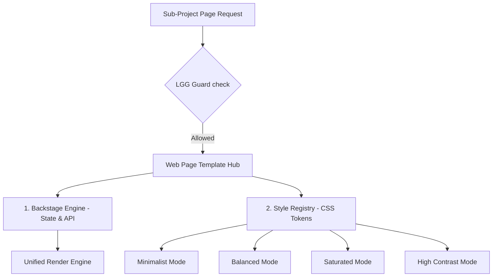

---
metadata:
  owner: "CISEM_GOVERNOR"
  canonical_location: "C:\\Users\\finky\\Desktop\\AntiGravity\\Cisem CsAg\\2026-08-06__CISEM__AntigravityLocal__TemplateHubPlan__V1.0.md"
  artifact_status: "DRAFT"
  maturity: "WORKING_DRAFT"
  version: "1.0"
  role_type: "IMPLEMENTATION_PLAN"
---

# CISEM Web Page Template Hub (WPTH) — Architectural Draft

The **Web Page Template Hub (WPTH)** is established in the workspace root directory to serve as the **Single Source of Truth (SSOT)** for all user interfaces across all sub-projects. It enforces a strict boundary between visual presentation styles and backend application engines.

---

## 1. Core Principles

1.  **Strict Decoupling**: A page's functionality (state machines, fetching logic, input handlers) is written once and remains immutable. The visual look (colors, paddings, typography, buttons) is loaded dynamically.
2.  **No Creative Drift**: AI agents are forbidden from writing custom inline styles, custom margins, or new component files. They must instantiate a predefined layout template from the Hub.
3.  **Strict Governance**: Creating a new template requires an explicit Governor signature in the Workspace Registry.

---

## 2. Structural Layer vs Visual Layer

### A. Predefined Layout Templates
The Hub defines standard structural mockups:
*   `TEMPLATE_DASHBOARD_GRID`: 3-column widget layout.
*   `TEMPLATE_SPLIT_CLARIFIER`: Left-side options list, right-side chat/clarification panel.
*   `TEMPLATE_CATALOG_TABLE`: Search, filter sidebar, results grid.
*   `TEMPLATE_DETAIL_VIEW`: Standard header, tabbed contents, sidebar summary.

### B. Dynamic Style Registry
A central style config defines token packages applied globally:
*   **Minimalist**: High whitespace, thin borders (`border-slate-100`), monocolor text, subtle micro-interactions.
*   **Balanced**: The default interface (current COMMARK colors, medium shadows).
*   **Saturated**: Deep gradients (`from-indigo-600 via-pink-500 to-amber-500`), dense shadows, active pulse animations.
*   **High Contrast**: Pure black/white borders, strong yellow indicators for accessibility.
