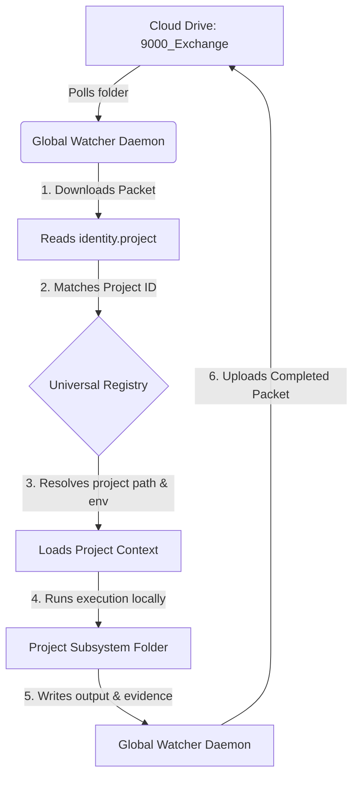
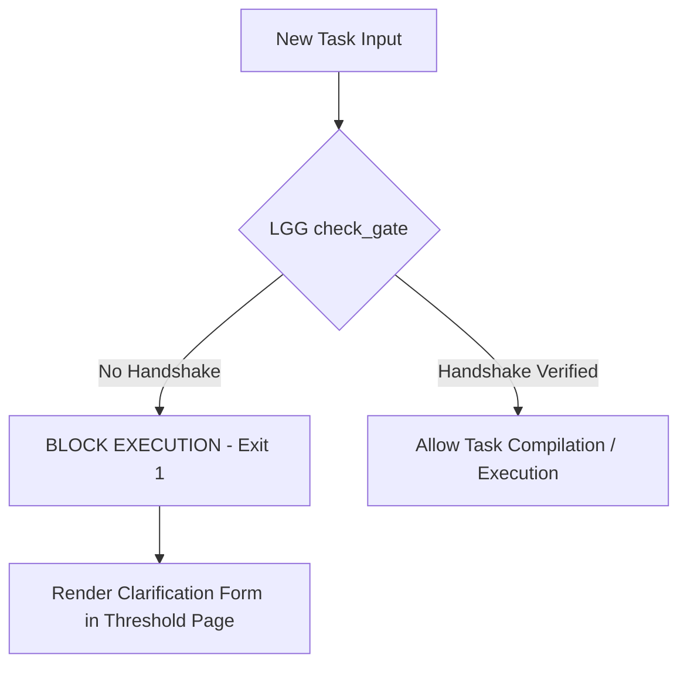
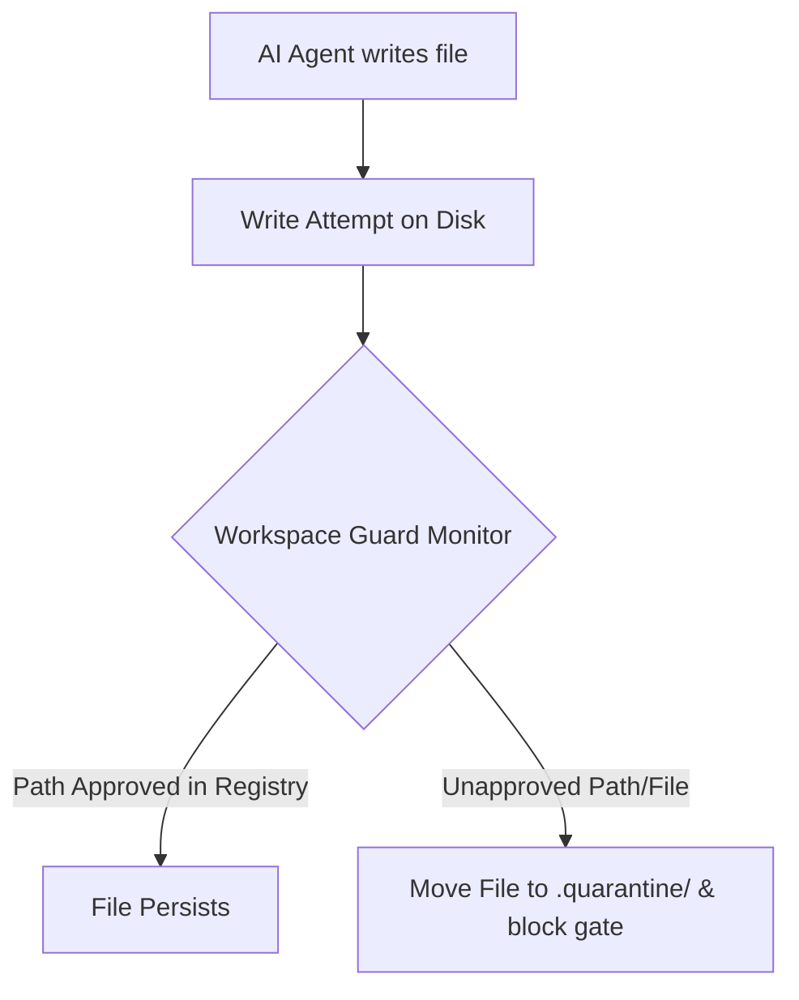

---
metadata:
  owner: "CISEM_GOVERNOR"
  canonical_location: "C:\\Users\\finky\\Desktop\\AntiGravity\\Cisem CsAg\\2026-08-06__CISEM__AntigravityLocal__UmbrellaImplementationPlan__V1.0.md"
  artifact_status: "DRAFT"
  maturity: "WORKING_DRAFT"
  version: "1.0"
  role_type: "IMPLEMENTATION_PLAN"
---

# Implementation Plan: CISEM Umbrella "Roof" Architecture

This plan establishes the architecture, directory routing, and data-flow model for the **CISEM Umbrella ("Roof") Structure**. This design allows you to manage multiple development projects (Supplier Scraper, Marketing CoreHub, etc.) under one unified, self-governing execution layer, managed by a single frontend interface.

---

## 1. Directory & Ownership Blueprint

The workspace root (`C:\Users\finky\Desktop\AntiGravity`) acts as the "roof." Project-specific workspaces are decoupled subdirectories.

```text
C:\Users\finky\Desktop\AntiGravity\  <-- THE UMBRELLA ROOF
│
├── 2026-08-05__CISEM__Universal_Workspace_and_Accountability_Registry__V1.1.yaml <-- SSOT Registry
├── 2026-08-05__GoogleAntigravity__Cxp__CxpWatcher__V0.1.py                       <-- Global Daemon Watcher
├── 2026-08-05__CISEM__CXP__Specification__V1.2.md                                 <-- CXP Spec rules
├── 2026-08-05__CISEM__CXP__PacketSchema__V1.2.schema.json                          <-- JSON Packet Schema
│
├── Marketing CoreHub CsAg\              <-- Project Subsystem 01
│   ├── .env
│   └── 9000__INTERSYSTEM_EXECUTION_EXCHANGE\ <-- Shared Exchange Subfolder
│
├── Supplier Scraper CsAg\               <-- Project Subsystem 02
│   ├── .env
│   ├── backend\
│   └── frontend\                        <-- Unified UI Dashboard (Next.js)
│
└── Planning CoreHub CsAg\               <-- Project Subsystem 03
```

---

## 2. Multi-Project Routing & Execution Flow

To support multiple projects under one roof, the **Global Watcher Daemon** uses the central registry to route executions dynamically:



### Routing Logic:
1.  **Packet Detection**: The Watcher Daemon (`CxpWatcher.py`) finds a `READY` packet in the shared Drive exchange.
2.  **Project Identification**: It parses the `identity.project` field inside the packet (e.g. `identity.project: "Supplier Scraper"`).
3.  **Context Loading**: It queries the `Universal Registry` to find the directory path and configuration variables for that specific project ID.
4.  **Isolated Execution**: It executes the script inside the resolved project directory, loading its unique `.env` and dependencies. This prevents projects from leaking into each other.
5.  **Audit Loop**: The completed packet is audited by the cloud auditor (Apps Script) and archived by the local watcher.

---

## 3. Unified Frontend Interface Integration

We will build the **CISEM Execution Layer Dashboard** directly inside the existing Next.js frontend under `Supplier Scraper CsAg/frontend`. 

### Layout Specification:
```text
┌────────────────────────────────────────────────────────────────────────┐
│  COMMARK UBOP                                    [ Dark Mode: On ]     │
│  [ Home ] [ Catalog ] [ Supplier Registry ] [ 🆕 CISEM CAEL Dashboard ] │
├────────────────────────────────────────────────────────────────────────┤
│                                                                        │
│  Project: [ Supplier Scraper      ▼ ]                                  │
│                                                                        │
│  System Status:                                                        │
│  ● Daemon Watcher: RUNNING (PID 21792)  ● Cloud Sync: ACTIVE           │
│                                                                        │
│  Active Mission Graph: MISSION-CISEM-AG-001                            │
│  ┌──────────────┐      ┌──────────────┐      ┌──────────────┐          │
│  │ Bootstrap01  │ ───> │   Test-001   │ ───> │ Successor01  │          │
│  │ (COMPLETED)  │      │ (COMPLETED)  │      │   (QUEUED)   │          │
│  └──────────────┘      └──────────────┘      └──────────────┘          │
│                                                                        │
│  Recent Events:                                                        │
│  - [15:49:35] Packet TEST-001 successfully AUDITED.                    │
│  - [15:49:35] Local watcher appended event PACKET_ARCHIVED.            │
│                                                                        │
└────────────────────────────────────────────────────────────────────────┘
```

---

## 4. Proposed Steps

### Component: Backend (Umbrella Watcher Hardening)
1.  **Resolve Relative Paths**: Update `CxpAdapter.py` and `CxpWatcher.py` to resolve schemas and matrix files from the parent directory dynamically by fetching the local `.env` path, rather than using relative literals (`../`).
2.  **Add Status API Endpoint**: Create a FastAPI endpoint inside `backend` to expose watcher heartbeats, PID status, and Registry details.

### Component: Frontend (UI Panel)
3.  **Add CAEL Tab**: Integrate a new `"execution_layer"` tab in the Next.js `page.tsx` view and navigation menu.
4.  **Create Monitor Component**: Build the UI tables and mission status graph charts to display registry contents in real time.

---

## 5. Verification Plan

### Automated Tests
*   `python WorkspaceReconciler.py` (Verify no file duplicates or breaks).
*   `npm run lint` inside the Next.js project to confirm no compilation errors.

### Manual Verification
1.  Verify the watcher PID appears on the UI status screen.
2.  Queue a new packet in Drive and confirm the visual graph transitions from `READY` $\rightarrow$ `EXECUTING` $\rightarrow$ `COMPLETED` $\rightarrow$ `AUDITED` on the frontend screen without requiring human reloads.

---

## 6. B2B Multi-Role & Module Bundling Rules Simulation

To ensure that different projects, operators, and external users can purchase, bundle, and execute modules securely, we establish a strict **Role-Intent Permission Matrix** mapped directly into the registry's capability rules.

### A. Role Definitions
*   **`operator_admin`**: Full platform authority. Can toggle capabilities, register clients, configure watchers, and bypass standard rate gates.
*   **`partner`**: Suppliers or logistics coordinators. Authorized to update SKU catalogs, lead times, and write inventory data.
*   **`buyer`**: External client accounts purchasing product bundles. Authorized to submit briefs, view quotes, and approve final proposals.
*   **`guest`**: Public/unauthenticated user. Limited to free product catalog search and public brief ingestion.

### B. Module Bundling Mapping
Platform capabilities are packaged into commercial "Modules" that are enabled per project tenant in the registry:

| Module Bundle | Included Capabilities / Intents | Allowed Roles |
| :--- | :--- | :--- |
| **Scraper Basic** | `TRIGGER_SCRAPE`, `UPDATE_SUPPLIER_SKU` | `partner`, `operator_admin` |
| **AI Ingestion** | `PARSE_BRIEF`, `GENERATE_QUESTIONS` | `guest`, `buyer`, `operator_admin` |
| **Commercial Hub** | `GENERATE_PROPOSAL`, `SEAL_QUOTE`, `VERIFY_PRICING` | `buyer`, `operator_admin` |

---

## 7. Simulated Execution Scenarios

### Scenario 1: Guest Ingests Brief (Free / Public Flow)
1. Guest enters brief on the home landing page: *"Need 200 bags under 100 shekels."*
2. System generates a packet with `identity.role: "guest"` and `execution.intent: "PARSE_BRIEF"`.
3. The adapter reads the `CapabilityRegistry` under `GUEST_PROFILE` $\rightarrow$ `PARSE_BRIEF` is marked `allowed: true`.
4. The watcher claims the packet, calls the parser backend, and updates the state to `COMPLETED`.
5. Cloud Orchestrator audits and archives it.
*Result: SUCCESS (Free public ingestion is completed autonomously).*

### Scenario 2: Unlicensed Buyer Attempts Proposal Generation (Restricted Flow)
1. A Buyer clicks "Generate Quote Proposal" but their project has not purchased the "Commercial Hub" module.
2. Frontend creates a packet with `identity.role: "buyer"` and `execution.intent: "GENERATE_PROPOSAL"`.
3. Before claiming, the adapter cross-references the project's capability profile in the Registry.
4. It finds that `GENERATE_PROPOSAL` capability is absent/license flag is `false`.
5. **Enforcement**: The validator triggers a **Governor Gate** (Security Policy Violation).
6. State transitions to `BLOCKED`. The cloud orchestrator logs a licensing error.
*Result: BLOCKED (Unauthorized intent is safely trapped by the governance gate).*

### Scenario 3: Admin Grants Module License to Partner (Commercial Upgrade Flow)
1. An `operator_admin` logs in and modifies the project's capability node in the Registry:
   ```yaml
   projects:
     - project_id: "SUPPLIER_SCRAPER"
       capabilities:
         - "SCRAPER_BASIC"
   ```
2. The Partner can now execute `TRIGGER_SCRAPE` packets successfully without triggering gates.
*Result: SUCCESS (Licensing is enforced and updated dynamically via registry modifications).*

---

## 8. Build Standards & AI Anti-Freestyling Constraints

To enforce absolute consistency across all sub-projects and prevent "AI freestyling" (spontaneous implementation of unapproved patterns, loose state parameters, or custom UI styles), every agent/adapter execution must align to the following constraints:

### A. Lifecycle State Alignment
Every task packet, log entry, and UI status indicator must strictly restrict its state values to the **10 Canonical Lifecycle States** defined in `StateTransitionMatrix__V1.2.yaml`.
*   Allowed values: `CREATED`, `READY`, `CLAIMED`, `EXECUTING`, `VALIDATING`, `COMPLETED`, `FAILED`, `BLOCKED`, `AWAITING_RATIFICATION`, `ARCHIVED`.
*   *Enforcement*: Any script or UI view attempting to introduce non-standard custom states (e.g. `IN_PROGRESS`, `PENDING_REVIEW`, `ERROR`) will trigger a validator failure in the reconciler.

### B. UI Component Consistency
To prevent ad-hoc design drift, all frontend pages (including Next.js and Tailwind screens) must share the following consistency elements:
1.  **Color Tokens**: Use only tailwind colors that map to the design system theme:
    *   *Primary Actions*: Gradients of `amber-500` to `orange-600` (e.g., `bg-gradient-to-r from-amber-500 to-orange-600`).
    *   *System Borders*: `border-slate-200` (light mode) and `border-slate-800` (dark mode).
    *   *Backgrounds*: `bg-white` (light mode) and `bg-slate-950` (dark mode).
2.  **No Custom CSS**: Inline CSS variables or ad-hoc Tailwind sizes are prohibited. All layouts must use the layout rules defined in the base components.
3.  **Role Isolation**: Component views must render states conditionally based strictly on `activeRole` (`guest`, `buyer`, `partner`, `operator_admin`).

### C. Data & API Protocol Consistency
1.  **Structured JSON Payload**: All backend-to-frontend payloads must return schemas matching the JSON design specifications.
2.  **API Version Routing**: Every API endpoint must align to the `/api/v1/` route convention.
3.  **Pre-Validation Check**: Before any change is written to code files, the reconciler must verify it against `WorkspaceReconciler.py` to check that no local project folder has decoupled its config rules from the root.

---

## 9. CISEM Universal Assets Framework (CUAF)

The **CISEM Universal Assets Framework (CUAF)** specifies that all shared schemas, matrices, registries, and core governance instructions must reside in the parent root workspace folder. Individual projects have no authority to override or duplicate these assets.

### Universal Assets Schema (`2026-08-06__CISEM__Universal_Subsystem_Mapping_Schema__V1.0.json`)
We define a new root schema file to govern the mapping between root assets and project sub-folders. This schema enforces:

```json
{
  "$schema": "http://json-schema.org/draft-07/schema#",
  "title": "UniversalSubsystemMapping",
  "type": "object",
  "required": ["root_assets", "project_mappings"],
  "properties": {
    "root_assets": {
      "type": "array",
      "items": {
        "type": "object",
        "required": ["asset_id", "canonical_path", "immutable"],
        "properties": {
          "asset_id": { "type": "STRING" },
          "canonical_path": { "type": "STRING" },
          "immutable": { "type": "BOOLEAN" }
        }
      }
    },
    "project_mappings": {
      "type": "array",
      "items": {
        "type": "object",
        "required": ["project_id", "local_directory", "required_inherits", "alignment_approved"],
        "properties": {
          "project_id": { "type": "STRING" },
          "local_directory": { "type": "STRING" },
          "required_inherits": {
            "type": "array",
            "items": { "type": "STRING" }
          },
          "alignment_approved": { "type": "BOOLEAN" }
        }
      }
    }
  }
}
```

---

## 10. Local Gateway Gates (LGG)

To prevent any local "AI freestyling" or unaligned executions within sub-projects, we will implement a mandatory entrypoint check in each sub-project:

*   **Marketing CoreHub**: `Marketing CoreHub CsAg/cisem_gate.py`
*   **Supplier Scraper**: `Supplier Scraper CsAg/cisem_gate.py`
*   **Planning CoreHub**: `Planning CoreHub CsAg/cisem_gate.py`

### Gateway Logic (Placeholder/Enforcer):
This gate script runs *before* any startup command, testing run, or build cycle. It checks:
1.  **Root Link Validation**: Verifies that the project folder contains active configurations resolving back to the parent directory assets.
2.  **Schema Conformance**: Asserts the local layout matches the `Universal_Subsystem_Mapping_Schema`.
3.  **Approval Validation**: Queries the root registry file to verify that the project's `alignment_approved` flag is explicitly set to `true`.

```python
# Placeholder Logic for cisem_gate.py
import sys
import yaml

def check_alignment():
    # 1. Load root registry
    try:
        with open("../2026-08-05__CISEM__Universal_Workspace_and_Accountability_Registry__V1.1.yaml", "r") as f:
            registry = yaml.safe_load(f)
    except Exception as e:
        print(f"CISEM_GATE_ERROR: Failed to read root registry. {e}")
        sys.exit(1)
        
    # 2. Check alignment_approved flag for current project
    # (If false or missing, block execution immediately)
    project_id = "CURRENT_PROJECT_ID"
    approved = False
    for project in registry.get("projects", []):
        if project.get("project_id") == project_id:
            approved = project.get("alignment_approved", False)
            break
            
    if not approved:
        print(f"CISEM_GATE_ERROR: Project {project_id} is BLOCKED. Alignment with Universal Root elements is not approved by the Governor!")
        sys.exit(1)
        
    print(f"CISEM_GATE: Project {project_id} is aligned and approved.")
    sys.exit(0)
```

If the gate check fails, it exits with code `1`, causing `npm run dev`, `pytest`, or any adapter watcher run to fail immediately.

---

## 11. Mechanical Clarification Enforcer (MCE)

To provide an honest answer: **No AI agent can permanently hardwire its own behavioral compliance inside its weights.** An agent's attention can drift, or context windows can get reset. 

Therefore, we must **mechanically enforce this via code**. We will implement the **Mechanical Clarification Enforcer (MCE)**. This system makes it physically impossible for the local adapter or build engine to execute a task unless a verified clarification handshake exists in the registry.



### A. The Clarification Handshake Schema (`clarification_handshake.json`)
Every new request, task, or page addition must be preceded by a verification file containing:
*   **Target Intent**: Explicit declaration of what is being built.
*   **Measurable Output Results**: The exact tests or DOM elements that will define completion.
*   **Governor Approval**: A boolean signed off by the user.

```json
{
  "taskId": "task_create_portal_threshold",
  "intent": "DEPLOY_STATIC_THRESHOLD_PAGE",
  "measurable_outputs": {
    "files_created": ["src/app/threshold/page.tsx"],
    "routing_path_accessible": "/threshold",
    "required_tests_pass": "npm run lint && npm run test"
  },
  "ratified_by_user": false
}
```

### B. Gateway Code Hardening
The `cisem_gate.py` script is updated to check for this handshake. If a new task is detected but `ratified_by_user` is `false`, it throws an error and exits, blocking all tools and compilers.

---

## 12. CISEM Workspace Guard (CWG) & The Quarantine Enforcer

To mechanically block unapproved file creation and prevent "AI freestyling" at the physical disk level, we introduce the **CISEM Workspace Guard (CWG)**. This background monitor runs locally alongside our watcher daemon.



### The Quarantine Mechanism:
1.  **File System Event Watcher**: The CWG uses a native python file watcher (e.g. `watchdog` library or polling) to intercept any file creations inside sub-project folders.
2.  **Registry Checking**: When a new file is detected (e.g., `Supplier Scraper CsAg/src/components/CoolChart.tsx`), CWG verifies its path against the `Universal_Subsystem_Mapping_Schema` and approved registry mappings.
3.  **Active Quarantine**: If the file is not pre-registered:
    *   CWG immediately **moves the file out of the project folder** to a root quarantine folder: `C:\Users\finky\Desktop\AntiGravity\.quarantine\`.
    *   It appends a security alert to the registry matrix.
    *   It locks the local gateway gate (`alignment_approved: false`).
4.  **Agent Result**: The AI agent's file write tool reports success, but immediately afterward, the agent finds that the file has disappeared from disk and the build has crashed, forcing the agent to conform to the approved templates.

---

## 13. Universal Principles of Harness-First Creation

To align all future development under this mechanical attitude, we define the **4 Core Universal Principles of Harness-First Creation**:

1.  **Immutability of Structure (No In-Folder Autonomy)**:
    Sub-project directories possess zero authority to define their own directory structures or configurations. All paths and layouts must inherit dynamically from the root specifications.
2.  **Schema-First Generation**:
    No file is ever written by "inspiration." All page layouts, API endpoints, or database mappings must instantiate a verified template schema pre-registered in the Web Page Template Hub (WPTH).
3.  **Harness-First Validation**:
    Any tool execution, developer action, or compilation run must pass through the Local Gateway Gates. The enforcer script must return exit code `0` before compilers (Vite, Next.js, Pytest) are allowed to spin up.
4.  **Consensus and Verification Checks**:
    No feature is complete until its corresponding Playwright/E2E test suite (e.g. `antigravity-validator.spec.ts`) passes automated verification. No promotion is allowed without the Top Admin's physical Governor ratification signature in the Workspace Registry.

---

## 14. Technical Consolidation Remedies & Implementations

To implement the findings documented in our Audit Draft Hub, we define the following mechanical implementation specs:

### A. Transport vs Application Splitting (Bootstrap Deadlock Remedy)
To prevent the gateway locking down the sync client, `cisem_gate.py` intercepts process startup using an execution category check:
*   **Allowed Transport Commands**: `python CxpWatcher.py`, `python WorkspaceReconciler.py`. (Allowed to run offline/unaligned to download signatures).
*   **Blocked Application Commands**: `next dev`, `next build`, `python main.py`. (Blocked until alignment approval signature exists).

### B. Lock-Before-Sync Protocol (Sync Race Remedy)
The watcher daemon check loop is updated to perform a local pre-sync file scan:
```python
# CxpWatcher.py Lock-Before-Sync check
import os
import sys

def check_local_lock():
    if os.path.exists(".gate_lock") or not reconciler_check_passed():
        print("Watcher locked: Local directory is unaligned. Aborting sync.")
        return False
    return True
```
No file packet is pushed to Google Drive if `.gate_lock` is present.

### C. Decoupled Gate Locks (`.gate_lock` Remedy)
The Workspace Guard (`CWG`) daemon writes conflicts to a temporary local `.gate_lock` file containing the offending file list, rather than modifying the master registry. The `cisem_gate.py` script reads this file:
```python
if os.path.exists(".gate_lock"):
    print("GATE BLOCKED: Unapproved files detected in quarantine.")
    sys.exit(1)
```

### D. MCE Ingestion Sanitization (Prompt Injection Remedy)
The catalog and document parser modules must pass raw file data through a regex-based token validator that filters out text patterns matching prompt boundaries (`/sys`, `system:`, `user:`, `ignore previous`) before writing JSON values to the DB.

### E. Lease-Based Task Heartbeats (Offline Recovery Remedy)
When a local worker claims a packet, the database schema registers a `lease_expires_at` timestamp (current time + 5 minutes). The local watcher sends a `/api/v1/cael/heartbeat` ping every 2 minutes. If offline for >5 minutes, the task is automatically released.

### F. Client Storage Theme Fallback (Edge Latency Remedy)
Our Next.js theme provider reads the client-side cookie/localStorage override before rendering components:
```typescript
const savedTheme = localStorage.getItem('matrix-theme-override') || cookieTheme;
document.documentElement.setAttribute('data-theme', savedTheme);
```
This forces instant theme renders without waiting for Vercel Edge caching updates.


