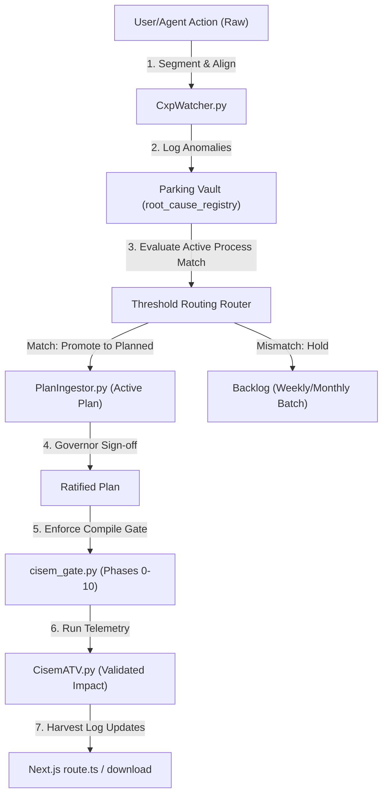

---
metadata:
  owner: "CISEM_GOVERNOR"
  plan_id: "CISEM-IP-20260807-HARMONIOUS-FLOW"
  canonical_location: "C:\\Users\\finky\\Desktop\\AntiGravity\\Cisem CsAg\\2026-08-07__AntigravityLocal__YarivHuman__Harmonious_Flow_Architecture_and_Ingestion_Plan__V1.0.md"
  artifact_status: "DRAFT"
  maturity: "WORKING_DRAFT"
  version: "1.0"
  role_type: "PLAN"
  blast_radius: "MEDIUM"
plan_id: "CISEM-IP-20260807-HARMONIOUS-FLOW"
title: "CISEM Harmonious Flow Architecture and Ingestion Plan"
version: "V1.0"
governor_signature: ""
blast_radius: "MEDIUM"
axioms_linked:
  - "AX-10000"
  - "PR-13900"
  - "PR-13950"
  - "PR-33500"
  - "PR-98000"
---

# CISEM Harmonious Flow Architecture & Ingestion Plan

This plan outlines the existing processes governing the CISEM platform and proposes concrete enhancements to unify **Planning**, **Threshold Routing**, **Vault Parking**, **Accountability**, and **Session Harvesting** into a single, seamless, and automated development pipeline.

## User Review Required

> [!IMPORTANT]
> - Review the proposed **Unified Lifecycle Engine** which joins all core stages under a single process state machine.
> - Review the **Active Process Router** which allows newly parked items to bypass scheduled reviews and integrate immediately if they relate to active planning, implementation, or research tasks.

## Open Questions
- Should the `cisem.py` CLI tool output text reports, or format metrics as a clean dashboard page in the Next.js frontend?

## Proposed Changes

### 1. What Exists Currently

#### 1.1. Planning
- **The Process**: We write implementation plans with YAML headers. The compilation gate runs `PlanIngestor.py` to assert correct headings, filename structures, and axiom links against `AxiomsAndPrinciples.md`.
- **Primary Files**: `cisem_core/planning/2026-08-07__CISEM__Planning__Specification__V1.0.md`, `cisem_core/planning/PlanIngestor.py`.

#### 1.2. Threshold Routing
- **The Process**: The compilation gate verifies registry alignment by checking if `alignment_approved: true` is set for the active project inside the workspace registry. If false, it blocks execution and directs the user to approve the handshake.
- **Primary Files**: `cisem_core/cisem_gate.py` (Phase 5 check), `cisem_core/2026-08-05__CISEM__Universal_Workspace_and_Accountability_Registry__V1.4.yaml`.

#### 1.3. Vault and Parking
- **The Process**: Design anomalies, process gaps, and feedback items are logged into the Parking Vault. A background watcher monitors registered file hashes and blocks compilation with `.gate_lock` if unapproved file drift or deletions occur.
- **Primary Files**: `cisem_core/cxp/CxpWatcher.py`, `cisem_core/sandbox/root_cause_registry.json`.

#### 1.4. Accountability and Task Management
- **The Process**: Enforced via `cisem_gate.py` through an 11-phase blocking gate checks (Phases 0-10) asserting plan headers, witness locking states, checksum matching, walkthrough existence, and axiom linkages. Retrospective audits are performed by `CisemATV.py`.
- **Primary Files**: `cisem_core/cisem_gate.py`, `cisem_core/sandbox/CisemATV.py`.

#### 1.5. Session Harvesting
- **The Process**: Active agent sessions dump logs and logs traversal inside the Next.js `route.ts` allows the browser to dynamically search active brain directories recursively to retrieve files.
- **Primary Files**: `src/app/api/download/route.ts`.

---

### 2. Unifying the Flow (The Connected Pipeline)

The diagram below shows how these components currently connect and interact:

---

### 3. Core Enhancements

#### 3.1. Unified State Lifecycle Engine
- **Improvement**: Replace the separate status registries (VAT, ATV, Watcher, Ingestor) with a single, synchronized state lifecycle. We will write a State Cascading module inside `WorkspaceReconciler.py`. When a plan is signed, it automatically updates the state of all related parked items from `parked` to `promoted` -> `planned` -> `validated_impact`.

#### 3.2. Programmatic Active Process Router (Threshold Hook)
- **Improvement**: Program `CxpWatcher.py` to read `ANTIGRAVITY_CONVERSATION_ID`. If a new gap or parked item matches the tags of the active plan in our current session directory, the router automatically unparks the item and links it to the active thread without waiting for the weekly batch.

#### 3.3. Automatic Session Harvester
- **Improvement**: Set up a lightweight cron task or gate hook that extracts the active session's turn metrics, P/E planning ratios, and satisfaction points directly from the `transcript_full.jsonl` file and logs them in a structured session file. This makes session metrics instantly visible to the next-step recommendation engines.

#### 3.4. Unified Control CLI (`cisem.py`)
- **Improvement**: Create a single command-line interface `cisem.py` in the workspace root. This will allow running `python cisem.py status` to read the unified pipeline status, `python cisem.py reconcile` to update hashes, and `python cisem.py audit` to execute CisemATV.

---

## Verification Plan

### Automated Tests
- Run `python cisem_core/cisem_gate.py` to confirm compilation compiles nominal under version `2.5`.
- Execute a dry-run check of the new `cisem.py` CLI to verify it lists all active processes, active brain directories, and registry status.

### Manual Verification
- Confirm that editing the Design Studio plan triggers metadata checks correctly and that the new version-sorted spec finder operates flawlessly.
