---
metadata:
  owner: "CISEM_GOVERNOR"
  canonical_location: "C:\\Users\\finky\\Desktop\\AntiGravity\\Cisem CsAg\\2026-08-10__CISEM__AntigravityLocal__SystemDependenciesMap__V1.0.md"
  artifact_status: "VERIFIED"
  maturity: "VERIFIED"
  version: "1.0"
  role_type: "SYSTEM_DEPENDENCY_MAP"
---

# System Dependencies Map

1.1. **Introduction**:
This document contains the visual dependency mapping for the CISEM platform code imports and database schemas, generated automatically by `GraphifyDependencyMapper`. It enforces bedrock axiom `AX-10000` ("Nothing Stand-Alone") and provides structural transparency.

## Python Code Import Dependency Graph

```mermaid
graph TD
    subgraph Python Scripts & Modules
        2026-08-10__AntigravityLocal__YarivHuman__PgVectorPartitionAuditVerification__V1.0["2026-08-10__AntigravityLocal__YarivHuman__PgVectorPartitionAuditVerification__V1.0.py"]
        Cisem CsAG Core Councils\Cisem AntiGravity & Gemini Brain\2026-08-08__AntigravityLocal__YarivHuman__SaaS_GeminiMultiModalEmbeddingService__V1.0["Cisem CsAG Core Councils\Cisem AntiGravity & Gemini Brain\2026-08-08__AntigravityLocal__YarivHuman__SaaS_GeminiMultiModalEmbeddingService__V1.0.py"]
        Cisem CsAG Core Councils\Cisem AntiGravity & Gemini Brain\2026-08-08__AntigravityLocal__YarivHuman__SaaS_PGVectorMultiTenantSearchService__V1.0["Cisem CsAG Core Councils\Cisem AntiGravity & Gemini Brain\2026-08-08__AntigravityLocal__YarivHuman__SaaS_PGVectorMultiTenantSearchService__V1.0.py"]
        backend\src\backend\__init__["backend\src\backend\__init__.py"]
        backend\src\backend\dto_models["backend\src\backend\dto_models.py"]
        backend\src\backend\embedding_service["backend\src\backend\embedding_service.py"]
        backend\src\backend\main["backend\src\backend\main.py"]
        backend\src\backend\mock_fixtures["backend\src\backend\mock_fixtures.py"]
        backend\src\backend\parking_vault_router["backend\src\backend\parking_vault_router.py"]
        backend\src\backend\pricing_engine["backend\src\backend\pricing_engine.py"]
        backend\src\backend\scraper_engine["backend\src\backend\scraper_engine.py"]
        backend\src\backend\seed_db["backend\src\backend\seed_db.py"]
        backend\src\backend\stock_verifier["backend\src\backend\stock_verifier.py"]
        backend\src\backend\vector_search_service["backend\src\backend\vector_search_service.py"]
        cisem_core\CisemSync["cisem_core\CisemSync.py"]
        cisem_core\CisemSyncSandbox["cisem_core\CisemSyncSandbox.py"]
        cisem_core\code\2026-08-08__AntigravityLocal__YarivHuman__SaaS_GeminiMultiModalEmbeddingService__V1.0["cisem_core\code\2026-08-08__AntigravityLocal__YarivHuman__SaaS_GeminiMultiModalEmbeddingService__V1.0.py"]
        cisem_core\code\2026-08-08__AntigravityLocal__YarivHuman__SaaS_PGVectorMultiTenantSearchService__V1.0["cisem_core\code\2026-08-08__AntigravityLocal__YarivHuman__SaaS_PGVectorMultiTenantSearchService__V1.0.py"]
        cisem_core\cxp\2026-08-05__GoogleAntigravity__Cxp__CxpAdapter__V0.1["cisem_core\cxp\2026-08-05__GoogleAntigravity__Cxp__CxpAdapter__V0.1.py"]
        cisem_core\cxp\2026-08-05__GoogleAntigravity__Cxp__CxpWatcher__V0.1["cisem_core\cxp\2026-08-05__GoogleAntigravity__Cxp__CxpWatcher__V0.1.py"]
        cisem_core\cxp\2026-08-05__GoogleAntigravity__Cxp__WorkspaceReconciler__V0.1["cisem_core\cxp\2026-08-05__GoogleAntigravity__Cxp__WorkspaceReconciler__V0.1.py"]
        cisem_core\cxp\download_drive_files["cisem_core\cxp\download_drive_files.py"]
        cisem_core\cxp\download_exchange_updates["cisem_core\cxp\download_exchange_updates.py"]
        cisem_core\cxp\download_subfolder_files["cisem_core\cxp\download_subfolder_files.py"]
        cisem_core\cxp\list_all_drive_files["cisem_core\cxp\list_all_drive_files.py"]
        cisem_core\cxp\list_and_download_2100["cisem_core\cxp\list_and_download_2100.py"]
        cisem_core\cxp\list_subfolder["cisem_core\cxp\list_subfolder.py"]
        cisem_core\cxp\update_response["cisem_core\cxp\update_response.py"]
        cisem_core\cxp\update_response_2100["cisem_core\cxp\update_response_2100.py"]
        cisem_core\find_loose_pages["cisem_core\find_loose_pages.py"]
        cisem_core\find_transcript_blink["cisem_core\find_transcript_blink.py"]
        cisem_core\ingest_wisdom["cisem_core\ingest_wisdom.py"]
        cisem_core\planning\2026-08-07__GoogleAntigravity__Planning__PlanIngestor__V0.2["cisem_core\planning\2026-08-07__GoogleAntigravity__Planning__PlanIngestor__V0.2.py"]
        cisem_core\platform_core\2026-08-10__CISEM__AntigravityLocal__CisemConfig__V1.0["cisem_core\platform_core\2026-08-10__CISEM__AntigravityLocal__CisemConfig__V1.0.py"]
        cisem_core\platform_core\2026-08-10__CISEM__AntigravityLocal__ContinuousAuditorDaemon__V1.0["cisem_core\platform_core\2026-08-10__CISEM__AntigravityLocal__ContinuousAuditorDaemon__V1.0.py"]
        cisem_core\platform_core\2026-08-10__CISEM__AntigravityLocal__GraphifyDependencyMapper__V1.0["cisem_core\platform_core\2026-08-10__CISEM__AntigravityLocal__GraphifyDependencyMapper__V1.0.py"]
        cisem_core\platform_core\2026-08-10__CISEM__AntigravityLocal__UserJourneySimulator__V1.0["cisem_core\platform_core\2026-08-10__CISEM__AntigravityLocal__UserJourneySimulator__V1.0.py"]
        cisem_core\platform_core\cisem_gate["cisem_core\platform_core\cisem_gate.py"]
        cisem_core\sandbox\2026-08-09__AntigravityLocal__YarivHuman__TenantContextValidationVerificationScript__V1.0["cisem_core\sandbox\2026-08-09__AntigravityLocal__YarivHuman__TenantContextValidationVerificationScript__V1.0.py"]
        cisem_core\sandbox\CisemATV["cisem_core\sandbox\CisemATV.py"]
        cisem_core\sandbox\CisemAuditor["cisem_core\sandbox\CisemAuditor.py"]
        cisem_core\sandbox\CisemSanitizer["cisem_core\sandbox\CisemSanitizer.py"]
        cisem_core\search_localstorage["cisem_core\search_localstorage.py"]
        cisem_core\search_page_return["cisem_core\search_page_return.py"]
        cisem_core\search_registry_references["cisem_core\search_registry_references.py"]
        cisem_core\search_studio_viewport["cisem_core\search_studio_viewport.py"]
        cisem_core\search_toggledarkmode["cisem_core\search_toggledarkmode.py"]
        cisem_core\update_axioms["cisem_core\update_axioms.py"]
        cisem_core\update_registry_v1.29["cisem_core\update_registry_v1.29.py"]
        cisem_core\update_registry_v1.31["cisem_core\update_registry_v1.31.py"]
        cisem_core\update_registry_v1.40["cisem_core\update_registry_v1.40.py"]
        cisem_core\update_registry_v1.41["cisem_core\update_registry_v1.41.py"]
        cisem_core\update_registry_v1.42["cisem_core\update_registry_v1.42.py"]
        cisem_core\update_registry_v1.43["cisem_core\update_registry_v1.43.py"]
        cisem_core\update_registry_v1.8["cisem_core\update_registry_v1.8.py"]
        cisem_core\upload_to_drive["cisem_core\upload_to_drive.py"]
        sandbox_code_review\sandbox_runner["sandbox_code_review\sandbox_runner.py"]
        scratch\2026-08-10__AntigravityLocal__LicensingExportTest__V1.0["scratch\2026-08-10__AntigravityLocal__LicensingExportTest__V1.0.py"]
        scratch\check_schema["scratch\check_schema.py"]
        scratch\check_walkthrough["scratch\check_walkthrough.py"]
        scratch\find_offending_file["scratch\find_offending_file.py"]
        scratch\fix_walkthrough["scratch\fix_walkthrough.py"]
        scratch\print_atv_results["scratch\print_atv_results.py"]
        scratch\print_registry_end["scratch\print_registry_end.py"]
        scratch\promote_walkthrough["scratch\promote_walkthrough.py"]
    end

    subgraph Import Channels
        main --> dto_models
        main --> pricing_engine
        main --> stock_verifier
        main --> scraper_engine
        main --> embedding_service
        main --> vector_search_service
        parking_vault_router --> main
        vector_search_service --> embedding_service
        2026-08-08__AntigravityLocal__YarivHuman__SaaS_PGVectorMultiTenantSearchService__V1.0 --> embedding_service
        2026-08-05__GoogleAntigravity__Cxp__CxpWatcher__V0.1 --> CisemSanitizer
    end
```

## Database Schema Relationship Graph

```mermaid
graph TD
    subgraph SQL Tables
        backlog_registry["backlog_registry"]
        catalog_item_sandbox_variants["catalog_item_sandbox_variants"]
        contacts["contacts"]
        custom_libraries["custom_libraries"]
        customer_accounts["customer_accounts"]
        deals["deals"]
        document_chunks["document_chunks"]
        feature_registry["feature_registry"]
        lookup_registry["lookup_registry"]
        package_feature_grants["package_feature_grants"]
        packages["packages"]
        pdf_queue["pdf_queue"]
        product_groups["product_groups"]
        product_variations["product_variations"]
        proposal_client_drafts["proposal_client_drafts"]
        role_definitions["role_definitions"]
        state_transitions["state_transitions"]
        status_library["status_library"]
        tag_library["tag_library"]
        template_registry["template_registry"]
        user_account_roles["user_account_roles"]
        users["users"]
    end

    subgraph Foreign Keys
        state_transitions --> status_library
        tag_library --> tag_library
        lookup_registry --> custom_libraries
        document_chunks --> tag_library
        document_chunks --> status_library
        backlog_registry --> status_library
        product_groups --> product_groups
        product_variations --> catalog_items
        catalog_item_sandbox_variants --> catalog_items
        proposal_client_drafts --> proposals
        contacts --> customer_accounts
        deals --> contacts
        deals --> briefs
        deals --> proposals
        package_feature_grants --> packages
        package_feature_grants --> feature_registry
        user_account_roles --> users
        user_account_roles --> customer_accounts
        user_account_roles --> role_definitions
        template_registry --> customer_accounts
        template_registry --> template_registry
    end
```


