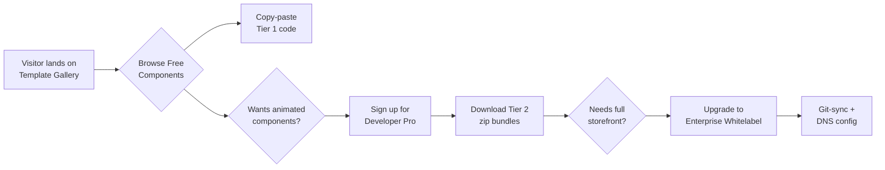

# 2.0 Core Council Evaluation Prompt: CISEM UX/UI Dashboard & Monetization Plan

<!-- Prepared by Claude Opus 4.6 (Antigravity Senior Builder) — 2026-08-10 -->

## 2.1. Evaluation Objective

Review the integration specifications, licensing controls, and execution order for the custom UX/UI Design System component dashboard, verifying that this architecture enables:

- 2.1.1. **Low-token visual prototyping** — components live as copy-paste source files in the repository, not as opaque npm dependencies, so Antigravity agents never need to read external library internals.
- 2.1.2. **Secure template monetization** — tiered licensing enforced cryptographically at the API boundary via signed `TenantContext` objects (per Enterprise Rule 15).
- 2.1.3. **Governor-controlled promotion** — every visual asset stages through sandbox isolation before registry inclusion, ensuring zero unaudited code reaches production routes.

---

## 2.2. Key Inquiry Area 1: Integration with Recent Decoupled Builds

| 2.2.1. Aspect | 2.2.2. Specification | 2.2.3. Governing Axiom |
| :--- | :--- | :--- |
| **Component Storage** | Copy-paste source configurations stored inside [`src/components/ui/`](file:///c:/Users/finky/Desktop/AntiGravity/Cisem%20CsAg/src/components/ui) rather than black-box npm libraries, giving developers complete layout customizability. | AX-10000 (Ownership & Traceability) |
| **Staging Workflow** | New components and templates are staged in [`src/app/sandbox/[sample]/`](file:///c:/Users/finky/Desktop/AntiGravity/Cisem%20CsAg/src/app/sandbox) where they run isolated previews before registry inclusion. | PR-95000 (3-Tier Scope Architecture) |
| **Compile-Time Gating** | The gating mechanism ([`cisem_gate.py`](file:///c:/Users/finky/Desktop/AntiGravity/Cisem%20CsAg/cisem_core/platform_core/cisem_gate.py)) enforces strict package limits, verifying any modifications to styling configurations or global CSS variables. | PR-76000 (Mechanical Blocking Gate) |
| **Registry Binding** | Every promoted component is registered in [`Universal_Workspace_and_Accountability_Registry`](file:///c:/Users/finky/Desktop/AntiGravity/Cisem%20CsAg/Cisem%20CsAG%20Core%20Councils/Cisem%20AntiGravity%20%26%20Gemini%20Brain/2026-08-05__CISEM__Universal_Workspace_and_Accountability_Registry__V1.14.yaml) with a `validation_metrics` block mapping Flow, Code, Optimization, Salad, and Security verification levels. | Enterprise Rule 19 |

### 2.2.5. Council Questions for Area 1

> [!IMPORTANT]
> - 2.2.5.1. Does the copy-paste architecture create **version-drift risk** when upstream libraries (shadcn/ui, Radix) release security patches? What is the proposed patch-propagation mechanism?
> - 2.2.5.2. How does `cisem_gate.py` distinguish between a legitimate Tailwind CSS variable update and an unauthorized global style mutation?
> - 2.2.5.3. Should promoted components carry their own `validation_metrics` sub-block, or inherit the parent template's metrics?

---

## 2.3. Key Inquiry Area 2: Monetization, Licensing Tiers, and Permissions

### 2.3.1. Three-Tier Commercial Licensing Structure

| 2.3.1.1. Tier | 2.3.1.2. Name | 2.3.1.3. Included Assets | 2.3.1.4. Access Method | 2.3.1.5. Price Signal |
| :--- | :--- | :--- | :--- | :--- |
| **Tier 1** | Free | Limited components (basic grids, default buttons, standard form inputs) | Manual copy-paste from public docs | Free / Lead-gen |
| **Tier 2** | Developer Pro | Animated components (Magic UI cards, Aceternity UI bentos, border-beam effects); full page zip bundle downloads | Authenticated API download with `TenantContext` validation | Monthly subscription |
| **Tier 3** | Enterprise Whitelabel | Complete multi-page storefront templates (Next.js Commerce kits); whitelabel DNS configurations and Git-sync capabilities | Signed whitelabel export endpoint; dedicated Git-sync pipeline | Annual contract + per-domain fee |

### 2.3.2. Permission Enforcement Architecture

- 2.3.2.1. All download and export API routes validate a **cryptographically signed `TenantContext`** object at the routing boundary (per Enterprise Rule 15).
- 2.3.2.2. The `TenantContext` carries: `tenant_id`, `tier_level`, `active_until`, `allowed_template_ids[]`, and an HMAC-SHA256 signature.
- 2.3.2.3. Unauthorized requests to premium endpoints return `403 Forbidden` with a structured JSON error body — no silent fallback to free tier.
- 2.3.2.4. Rate limiting is applied per `tenant_id` to prevent bulk scraping of Tier 2/3 assets.

### 2.3.3. Council Questions for Area 2

> [!WARNING]
> - 2.3.3.1. Is HMAC-SHA256 sufficient for `TenantContext` signing, or should we use asymmetric signatures (Ed25519) to allow third-party verification without sharing the secret?
> - 2.3.3.2. How do we handle **tier downgrades** mid-cycle? Does the customer retain downloaded assets, or do we revoke Git-sync access immediately?
> - 2.3.3.3. What is the refund/dispute mechanism if a whitelabel DNS configuration fails and the customer cannot launch?

---

## 2.4. Key Inquiry Area 3: Dashboard Layout and Customization UX/UI

### 2.4.1. Interactive Preview Canvas

- 2.4.1.1. Previews are rendered inside an **interactive canvas** supporting resizable viewport toggles: **Desktop** (1440px), **Tablet** (768px), and **Mobile** (375px).
- 2.4.1.2. **Light/Dark theme switches** toggle the entire preview frame, not just the component, so customers see full-page context in both modes.
- 2.4.1.3. The canvas runs in an isolated `<iframe>` sandbox to prevent preview CSS from leaking into the dashboard shell.

### 2.4.2. Live HSL Variable Configurator

- 2.4.2.1. HSL variable configurators allow **live styling edits on-screen**, modifying `--background`, `--foreground`, `--primary`, `--accent`, and `--radius` in real time.
- 2.4.2.2. The configurator generates **clean Tailwind classes dynamically** for export — customers download a `globals.css` file with their exact customizations baked in.
- 2.4.2.3. A "Reset to Default" action restores the original shadcn/ui HSL palette without page reload.

### 2.4.3. Micro-Animation Boundaries

- 2.4.3.1. Previews utilize **micro-animations** (border-beams, layout glows, shimmer effects) to visually show structural boundaries before downloading.
- 2.4.3.2. These animations are **preview-only** — the exported code strips them unless the customer explicitly opts in (Tier 2+ feature).
- 2.4.3.3. Animation rendering uses `framer-motion` with `prefers-reduced-motion` media query respect for accessibility compliance.

### 2.4.4. Council Questions for Area 3

> [!TIP]
> - 2.4.4.1. Should the HSL configurator support **saving named palettes** (e.g., "Corporate Blue", "Warm Sunset") for reuse across multiple template downloads?
> - 2.4.4.2. Is the `<iframe>` sandbox sufficient for CSS isolation, or should we use Shadow DOM for deeper encapsulation?
> - 2.4.4.3. How do we handle **accessibility contrast validation** in the live HSL editor — should we block exports that fail WCAG AA?

---

## 2.5. Key Inquiry Area 4: Implementation Sequencing & Technical Reasoning

### 2.5.1. Execution Order

| 2.5.1.1. Step | 2.5.1.2. Name | 2.5.1.3. Action | 2.5.1.4. Reasoning |
| :--- | :--- | :--- | :--- |
| **Step 1** | Base Setup | Initialize shadcn configurations (`npx -y shadcn@latest init -y`) and install `framer-motion` to establish style boundaries. | Everything downstream depends on the Tailwind token system and `cn()` utility being present. This is the **keystone** — it unblocks Steps 2–5. |
| **Step 2** | Staging | Build the isolated `/sandbox` routes to safely verify component code before promotion. | Without sandbox isolation, untested components would land directly in production routes, violating PR-95000 and the Governor-controlled promotion protocol. |
| **Step 3** | Template Database | Define [`templates_registry.json`](file:///c:/Users/finky/Desktop/AntiGravity/Cisem%20CsAg/templates/templates_registry.json) mapping templates to their structural assets, tier assignments, and `validation_metrics`. | The registry is the **single source of truth** for what is available at each tier. Without it, the licensing API (Step 5) has nothing to enforce against. |
| **Step 4** | Dashboard Canvas | Build the layout selectors, theme pickers, viewport toggles, and HSL configurator UI. | This is the **customer-facing value surface**. It must be built after the registry (Step 3) so it knows what to display, but before the licensing API (Step 5) so it can be tested end-to-end. |
| **Step 5** | Licensing API | Integrate signed `TenantContext` validation to secure whitelabel exporter endpoints. | This is the **monetization gate**. It must be the final step because it wraps around everything above — you cannot secure what doesn't exist yet. |

### 2.5.2. Keystone Analysis (per AGENTS.md Rule 6)

> **Keystone Evaluation**: Step 1 (Base Setup) is the highest-priority keystone. Completing it unblocks:
> 1. Sandbox route rendering (Step 2)
> 2. Template registry population (Step 3)
> 3. Dashboard canvas styling (Step 4)
> 4. Export endpoint output formatting (Step 5)
>
> No other single step unblocks more than 4 dependent mechanisms.

### 2.5.3. Council Questions for Area 4

> [!CAUTION]
> - 2.5.3.1. Should Step 3 (Template Database) use a flat JSON registry or a structured YAML file consistent with the existing `Universal_Workspace_and_Accountability_Registry` format?
> - 2.5.3.2. Can Steps 2 and 3 be parallelized, or does the sandbox route structure depend on the registry schema?
> - 2.5.3.3. What is the **minimum viable template count** required before Step 4 (Dashboard Canvas) can be meaningfully demonstrated to a customer?

---

## 3.0 How This Serves External Users

### 3.1. Customer Journey

### 3.2. Value Proposition per Tier

- 3.2.1. **Free users** get enough to validate the quality, creating a pipeline for upgrades.
- 3.2.2. **Developer Pro** users save 20–40 hours per project by downloading battle-tested animated sections instead of building from scratch.
- 3.2.3. **Enterprise Whitelabel** users get a turnkey storefront they can rebrand and deploy under their own domain — the highest-margin product.

---

## 4.0 Document Validation & Reporting

| 4.1. Full Filename | 4.2. Active Version | 4.3. Clickable Link | 4.4. Download Link |
| :--- | :--- | :--- | :--- |
| `2026-08-10__CISEM__CoreCouncil__UxUiDashboardAndMonetizationStrategy__V1.0.md` | Version 1.0 | [UxUiDashboardAndMonetizationStrategy](file:///c:/Users/finky/Desktop/AntiGravity/Cisem%20CsAg/2026-08-10__CISEM__CoreCouncil__UxUiDashboardAndMonetizationStrategy__V1.0.md) | [Download MD File](http://localhost:3000/api/download?filename=2026-08-10__CISEM__CoreCouncil__UxUiDashboardAndMonetizationStrategy__V1.0.md) |
| `implementation_plan.md` | Version 1.6 | [implementation_plan](file:///C:/Users/finky/.gemini/antigravity/brain/7ab8f311-e871-43fb-b5f8-6671cb1eb4c9/implementation_plan.md) | [Download MD File](http://localhost:3000/api/download?filename=implementation_plan.md) |

---

## 5.0 Mandatory Next-Step Recommendation

> [!IMPORTANT]
> 5.1. **Council Members**: Review the four inquiry areas above and provide addressable verdicts (e.g., "Approve 2.3.2 but reject 2.4.4.3").
>
> 5.2. **Governor**: Once Council verdicts are collected, approve the implementation plan to authorize Step 1 (Base Setup). Click the **Proceed** button on the [`implementation_plan`](file:///C:/Users/finky/.gemini/antigravity/brain/7ab8f311-e871-43fb-b5f8-6671cb1eb4c9/implementation_plan.md) artifact to begin execution.
>
> 5.3. **Priority Justification**: Step 1 is the keystone — it unblocks all 4 remaining steps. Delaying it delays the entire monetization pipeline.

---

*Prepared by **Claude Opus 4.6** (Antigravity Senior Builder) — 2026-08-10T08:43:00Z*
