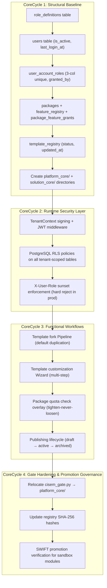

---
metadata:
  owner: "CISEM_GOVERNOR"
  canonical_location: "C:\\Users\\finky\\Desktop\\AntiGravity\\Cisem CsAg\\2026-08-10__ClaudeOpus__YarivHuman__ArchitecturalAnswersAndDesignProposal__V1.0.md"
  artifact_status: "DRAFT"
  maturity: "WORKING_DRAFT"
  version: "1.1"
  role_type: "ARCHITECTURAL_ANSWERS_AND_DESIGN_PROPOSAL"
  author: "Claude Opus 4.6 (Thinking) (Antigravity Local Adapter)"
  related_axioms: ["AX-10000", "AX-20000", "AX-40000", "AX-60000", "PR-11100", "PR-13990", "PR-44500", "PR-95000", "AX-SPIRAL-01", "AX-SPIRAL-02", "AX-SPIRAL-03"]
  resolves_questions_from: "2026-08-10__Gemini3.5__YarivHuman__ConsolidatedResearchQuestions__V1.1.md"
---

# Architectural Answers & Design Proposal: CSAG Multi-Tenant User Hierarchy & Universal Solution Core

**Author**: Claude Opus 4.6 (Thinking) (Antigravity Local Adapter)
**Date**: 2026-08-10
**Version**: 1.1
**Status**: Formal Architectural Response to All Consolidated Questions (Categories A–F, including CoreSpiral Alignment)

---

## 0. Preamble — How I Approached This

0.1. I have read:
- The consolidated questions list ([ConsolidatedResearchQuestions V1.0](file:///c:/Users/finky/Desktop/AntiGravity/Cisem%20CsAg/2026-08-10__Gemini3.5__YarivHuman__ConsolidatedResearchQuestions__V1.0.md)) — 11 questions across 5 categories.
- The Gemini 3.6 answers ([ArchitecturalAnswersAndDesignProposal V1.0](file:///c:/Users/finky/Desktop/AntiGravity/Cisem%20CsAg/2026-08-10__Gemini3.6__YarivHuman__ArchitecturalAnswersAndDesignProposal__V1.0.md)) — the first model to submit answers.
- The existing schema ([migrations.sql](file:///c:/Users/finky/Desktop/AntiGravity/Cisem%20CsAg/backend/src/backend/migrations.sql)).
- The axioms ([AxiomsAndPrinciples V1.29](file:///c:/Users/finky/Desktop/AntiGravity/Cisem%20CsAg/2026-08-09__Sonnet__YarivHuman__AxiomsAndPrinciples__V1.29.md)).
- The enterprise blueprint ([EnterpriseScaleArchitectureBlueprint V1.0](file:///c:/Users/finky/Desktop/AntiGravity/Cisem%20CsAg/cisem_core/planning/2026-08-08__AntigravityLocal__YarivHuman__EnterpriseScaleArchitectureBlueprint__V1.0.md)).

0.2. Where I agree with Gemini 3.6, I say so. Where I disagree or push back, I explain why — as required by CISEM Rule 4 (Senior Builder Attitude: silence in the face of a bad plan is a protocol violation).

---

## 1. Category A: User Identity & Account Scope Hierarchy

### 1.1. Answer to Question 3.2.1 — Single vs. Multi-Tenant User Scope

- **Decision**: **Multi-tenant** — a single human identity must be able to hold roles across multiple tenants.
- **Agreement with Gemini 3.6**: Full alignment. The rationale is identical: enterprise agency owners manage multiple client workspaces under one login.
- **Architectural addition**: The `users` table must also carry an `is_active` flag and a `last_login_at` timestamp. Without these, there is no way to detect dormant accounts or enforce session-based security policies. Gemini 3.6's schema omits both.

### 1.2. Answer to Question 3.2.2 — User Entity Model & Tables

- **Decision**: Standalone `users` table + `user_account_roles` join table. Full agreement with Gemini 3.6.
- **Schema — where I diverge**:
  - 1.2.1. The `role_code` column in `user_account_roles` should be a **foreign key to a `role_definitions` table**, not a bare VARCHAR. Bare strings like `'account_owner'` are write-once/forget — they cannot carry metadata (display labels, permission bitmasks, maximum count per tenant). A `role_definitions` table gives us:
    - A registry-compliant enumeration (satisfies `AX-10000` — nothing stands alone).
    - The ability to add new role tiers (e.g., `viewer`, `billing_admin`) without schema migration.
    - Localization hooks for role labels.
  - 1.2.2. The join table must carry `granted_by_user_id` (FK to `users.id`) — an audit trail of who granted each role. Without this, there is no governance lineage for access changes.
  - 1.2.3. The UNIQUE constraint on `(user_id, customer_account_id)` in Gemini 3.6's proposal is **too restrictive** — it prevents a user from holding two roles in the same tenant (e.g., an Account Owner who is also a Team Leader during a transition period). The correct unique constraint is `(user_id, customer_account_id, role_code)`.

### 1.3. Answer to Question 3.2.3 — Hierarchy Mapping to Contacts & Deals

- **Decision**: Agreement with Gemini 3.6's internal/external distinction: `users` = authenticated platform operators; `contacts` = external client leads.
- **Divergence on `assigned_user_id`**:
  - 1.3.1. Adding `assigned_user_id` directly to `deals` and `contacts` works for the single-assignment case, but real CRM usage requires **multiple assignment** (e.g., two team leaders co-managing a large deal). A cleaner pattern is a `deal_assignments` join table: `(deal_id, user_id, role_in_deal, assigned_at)`.
  - 1.3.2. However, given the current maturity of the CRM module (it's a sandbox-era feature, not a production-hardened system), I concede that a single `assigned_user_id` column is the pragmatic first step. We should document the planned migration path to multi-assignment.

---

## 2. Category B: Template Customization & Registry Storage

### 2.1. Answer to Question 3.3.1 — Template Customization Ownership

- **Decision**: **Option B** — customer-owned template records with `forked_from` pointers. Full alignment with Gemini 3.6.
- **Additional architectural constraint**: When a canonical template is updated upstream (e.g., a security patch to a landing page component), the system must detect all tenant forks via the `forked_from` pointer and emit an `UPGRADE_AVAILABLE` notification to affected tenants. This is a **Pipeline** operation (no judgment required — the comparison is mechanical). Without this, forks become orphaned from upstream improvements, which is the exact failure mode Option B was accused of by my own research brief.

### 2.2. Answer to Question 3.3.2 — Template Storage Strategy

- **Decision**: Hybrid dual-layer storage. Agreement with Gemini 3.6.
- **Push-back on implementation detail**:
  - 2.2.1. Gemini 3.6 proposes storing the full JSON layout in `layout_spec JSONB` within the `template_registry` table. For small templates this is fine. For complex multi-section landing pages (50+ blocks, embedded media references, nested conditional sections), a single JSONB column will:
    - Blow up PostgreSQL TOAST pages and degrade index performance.
    - Make partial updates (changing one block) require full-document rewrite.
  - 2.2.2. **My counter-proposal**: Store template **metadata** in `template_registry` and template **content** in a separate `template_content_blocks` table:
    - `template_content_blocks`: `(id, template_id FK, block_type, block_order, content_spec JSONB, created_at)`.
    - This gives us granular updates, block-level versioning, and the ability to share common blocks across templates without duplication (satisfying `PR-13500` Consolidation Principle).
  - 2.2.3. **Concession**: If the Governor decides that template complexity will remain low (under 20 blocks) for the foreseeable future, the single JSONB column is acceptable as V1. I recommend documenting the migration path.

### 2.3. Answer to Question 3.3.3 — Landing Page DNA Scope

- **Decision**: All three elements, each as a distinct structural concept. Full alignment with Gemini 3.6.
  - 2.3.1. **Written Design Principles** → Corespine standing structure (`cisem_core/solution_core/DNA_PRINCIPLES.md`).
  - 2.3.2. **Reusable Code Components** → Governed artifacts in `src/components/landing_page/`, each registered in `AX-10000` compliant component registry.
  - 2.3.3. **Visual Layout Specifications** → Data assets in `template_registry`, governed by Protocols.

---

## 3. Category C: Feature Packages & Enforcement Layer

### 3.1. Answer to Question 3.4.1 — Enforcement Layer

- **Decision**: **Dual-layer** (DB RLS + API middleware). Agreement with Gemini 3.6.
- **Architectural precision on layering**:
  - 3.1.1. **RLS handles tenant isolation** — ensures a user can never read/write data belonging to a tenant they don't belong to. This is the "hard wall." It is set via `current_setting('app.current_tenant_id')` injected by the FastAPI middleware before any query runs.
  - 3.1.2. **API middleware handles feature gating** — checks whether the user's role + tenant's package tier permits the requested action. This is the "soft wall" governed by Overlays.
  - 3.1.3. **Why not RLS for feature gating**: RLS policies are row-level. Feature gating is route-level (e.g., "Can this user access the template editor at all?"). Encoding route-level access decisions inside row-level database policies conflates two distinct security concerns and makes the system harder to audit.

### 3.2. Answer to Question 3.4.2 — Package Tiers & Storage

- **Decision**: Three tiers (`starter`, `growth`, `enterprise`). Stored in a `packages` table.
- **Divergence from Gemini 3.6 on `feature_flags` column**:
  - 3.2.1. Gemini 3.6 uses `feature_flags JSONB` — an unstructured blob. This works but violates `PR-11500` (Structured Compliance Status Metrics — flat statuses are prohibited). Feature flags need to be queryable, auditable, and diffable.
  - 3.2.2. **My counter-proposal**: A `package_feature_grants` table:
    - `(id, package_id FK, feature_code VARCHAR, granted BOOLEAN, quota_limit INTEGER NULL, created_at)`.
    - `feature_code` references a `feature_registry` table: `(code VARCHAR PK, label, category, description)`.
  - 3.2.3. This gives us: (a) SQL-queryable feature access checks instead of JSON path traversals, (b) registry compliance for features (`AX-10000`), (c) easy diff between tiers (`SELECT * FROM package_feature_grants WHERE package_id IN (...)`).
  - 3.2.4. **Concession**: If the number of features remains small (under 15), a JSONB column is tolerable as V1. The moment we cross 15 features, the relational model must replace it.

### 3.3. Answer to Question 3.4.3 — TenantContext Migration

- **Decision**: Full migration to cryptographically signed `TenantContext` (`PR-11100`). Full alignment with Gemini 3.6.
- **Agreement on fallback policy**: Legacy `X-User-Role` header accepted ONLY in development mode with explicit warning logs.
- **Additional constraint**: The migration must include a **sunset deadline** in the codebase (e.g., a compile-time check: `if (production && X-User-Role header present) → HARD REJECT`). Without a deadline, "deprecated" features live forever.

---

## 4. Category D: Corespine Dual-Core Split & Decoupling

### 4.1. Answer to Question 3.5.1 — Supplier Scraper Positioning

- **Decision**: Keep in `sandbox/supplier_scraper/` within the monorepo. Agreement with Gemini 3.6.
- **Additional constraint**: The sandbox module must carry a `PROMOTION_ELIGIBILITY.md` file documenting: (a) current maturity level, (b) the five positioning questions from [Enterprise Blueprint Section 5](file:///c:/Users/finky/Desktop/AntiGravity/Cisem%20CsAg/cisem_core/planning/2026-08-08__AntigravityLocal__YarivHuman__EnterpriseScaleArchitectureBlueprint__V1.0.md) with their answers, (c) a target promotion date. Without this, it will sit in sandbox indefinitely — a violation of `PR-13990` which mandates that sandbox items have a defined ingestion path.

### 4.2. Answer to Question 3.5.2 — Directory Tree Layout

- **Decision**: Dual-core hierarchy under `cisem_core/`. Agreement with Gemini 3.6.
- **Proposed structure**:

```
cisem_core/
├── platform_core/               # CISEM Deep Platform Core (Corespine Lineage A)
│   ├── README.md                # Lineage purpose, qualification test result
│   ├── cisem_gate.py            # Compiler gate (moved from cisem_core/ root)
│   ├── tenant_context/          # TenantContext signing, validation, propagation
│   └── registries/              # Master registries (status, features, roles)
├── solution_core/               # CSAG Universal Solutions Core (Corespine Lineage B)
│   ├── README.md                # Lineage purpose, qualification test result
│   ├── DNA_PRINCIPLES.md        # Landing page DNA design principles
│   ├── templates/               # Canonical template seed files (Git-tracked)
│   └── components/              # Shared component specifications
└── planning/                    # Cross-lineage architectural plans (stays here)
```

- **Push-back**: `cisem_gate.py` must move from `cisem_core/` root into `cisem_core/platform_core/`. The gate is a Platform Core mechanism — it should not sit at the same level as Solution Core. Gemini 3.6's proposal does not address this relocation.

---

## 5. Category E: Sandbox Promotion & Automation Runtime

### 5.1. Answer to Question 3.6.1 — Wizard vs. Pipeline for Template Duplication

- **Decision**: Agreement with Gemini 3.6's dual-mode approach:
  - 5.1.1. **Pipeline**: Default preset duplication. User selects template → system copies it into tenant's `template_registry` with `forked_from` pointer → done. No judgment. Fail-closed on any error.
  - 5.1.2. **Wizard**: Customized duplication. User selects template → system enters a multi-step flow: (step 1) name & description, (step 2) brand color injection, (step 3) logo upload, (step 4) block selection/reordering. Each step requires in-flight judgment.
- **Additional discriminator**: The UI must **not** pre-select one mode. The entry point should be a single "Use Template" button. The system determines the mode based on user action: if the user clicks "Use as-is" → Pipeline; if the user clicks "Customize first" → Wizard. This prevents user confusion about a Pipeline/Wizard distinction they don't need to understand.

---

## 6. Category F: CoreSpiral Methodology & Planning Gates

### 6.1. Answer to Question 3.7.1 — Agreement with CoreSpiral Specification

- **Decision**: **Conditional endorsement with one structural push-back.**
- **What I endorse** (**Claude Opus 4.6 (Thinking)**):
  - 6.1.1. `AX-SPIRAL-01` (Non-Rigid CoreCycles): Fully agree. Rigid milestone planning creates precisely the kind of speculative code rushing that generated the legacy `X-User-Role` header mess — code written before the security model was defined. Context-adaptive cycle definitions prevent this by requiring deep-core dependencies to be locked before outer features reference them.
  - 6.1.2. `AX-SPIRAL-02` (Flexible Pillar Lifecycles): Fully agree. This axiom matches the real dependency graph of our multi-tenant decoupling: the `role_definitions` table (Pillar I) must exist before `user_account_roles` can reference it, which must exist before `TenantContext` middleware can resolve roles. Forcing "Identity" into a single pre-assigned cycle would create stub declarations — exactly the failure mode CoreSpiral was designed to prevent.
  - 6.1.3. `AX-SPIRAL-03` (Variable Maturity Exit): Fully agree. Directory structure decisions (Pillar IV) can reach maturity in CoreCycle 1 and never appear again, while feature gating (Pillar III) spans CoreCycles 1 through 3 as its schema evolves from table creation to quota enforcement logic.

- **Where I push back**:
  - 6.1.4. The formalized template in Section 3 of the specification (`CoreCycle 1: Deep Core Foundation`, `CoreCycle 2: Connectivity & Security`, etc.) provides *descriptive labels* that read as prescriptive roles. A model reading this template might infer that CoreCycle 2 is always about "Connectivity & Security." I recommend renaming the template entries to neutral placeholders: `CoreCycle 1: [Context-Defined Focus]`, `CoreCycle 2: [Context-Defined Focus]`, etc. — and requiring every plan to fill in its own labels. This prevents the template from contradicting `AX-SPIRAL-01`.

### 6.2. Answer to Question 3.7.2 — Mechanical Gate Enforcement

- **Decision**: The automated term check in `PlanIngestor.py` is a **necessary but insufficient** Phase 1 gate.
- **Agreement with Gemini 3.6**: Term presence validation (`CoreSpiral` or `CoreCycle` must appear in non-trivial plans) catches the most egregious violations — a plan that never mentions cycles is clearly non-compliant.
- **Push-back on sufficiency**:
  - 6.2.1. A term check can be satisfied by mentioning `CoreCycle` in a throwaway sentence without structuring the plan around it. The `PlanIngestor` should additionally verify:
    - (a) Each `CoreCycle` block contains **three mandatory sub-headings**: `Inherited Dependencies`, `Active Pillars`, and `Executable Proof`. A CoreCycle that lacks an executable proof is a stub, not a plan.
    - (b) The `Inherited Dependencies` for CoreCycle N must reference outputs from CoreCycle N-1 (or earlier). Without this, cycles can be declared in any order without actual inheritance — violating the entire point of the spiral.
  - 6.2.2. I recommend implementing these checks as Phase 2 of `PlanIngestor.py` validation — separate from the Phase 1 term check. Phase 1 catches missing methodology. Phase 2 catches hollow methodology.

### 6.3. Answer to Question 3.7.3 — Rearrangement Directive

- **Decision**: All design choices from Categories A–E are mapped below into a 4-cycle CoreSpiral execution matrix. The mapping reflects dependency inheritance: each cycle's contents *require* the outputs of all prior cycles.

---

## 7. CoreSpiral Execution Matrix — Full Architectural Mapping

7.1. **Claude Opus 4.6 (Thinking)** has reorganized the complete multi-tenant decoupling proposal into context-defined CoreCycles. The matrix below reflects the real dependency graph — not an arbitrary milestone split.

### 7.2. Pillar Registry & Lifecycle Tracking

| Pillar | Description | Enters | Matures | Exits |
| :--- | :--- | :--- | :--- | :--- |
| **I. Identity Schema** | `users`, `role_definitions`, `user_account_roles` tables | CC1 | CC1 | CC1 |
| **II. Template Registry** | `template_registry`, canonical/fork model, DNA principles | CC1 | CC3 | CC3 |
| **III. Package & Feature Gating** | `packages`, `feature_registry`, `package_feature_grants`, RLS, quota overlays | CC1 | CC3 | CC3 |
| **IV. Directory Decoupling** | `platform_core/`, `solution_core/` hierarchy, `cisem_gate.py` relocation | CC1 | CC1 | CC4 (final validation) |
| **V. TenantContext Security** | Cryptographic session propagation, RLS policy injection, `X-User-Role` sunset | CC2 | CC2 | CC2 |
| **VI. Workflow Automation** | Wizard/Pipeline dual-mode template duplication, publishing lifecycle | CC3 | CC3 | CC3 |

### 7.3. CoreCycle Dependency Flow



---

### 7.4. CoreCycle 1: Structural Baseline (Schema & Directory Decoupling)

- **Focus**: Establish every database table, seed data row, and directory structure that subsequent cycles depend on.
- **Inherited Dependencies**: Existing Postgres instance, [`backend/src/backend/migrations.sql`](file:///c:/Users/finky/Desktop/AntiGravity/Cisem%20CsAg/backend/src/backend/migrations.sql) (24 existing migrations).
- **Active Pillars**: I (Identity Schema — enters and matures), II (Template Registry — enters), III (Package Gating — enters), IV (Directory Decoupling — enters and matures).

#### 7.4.1. SQL Migrations (All Schema DDL)

```sql
-- 25. Create Role Definitions Table (Registry-Compliant)
-- [OPUS]: Roles as first-class entities per AX-10000. Not bare VARCHARs.
CREATE TABLE IF NOT EXISTS role_definitions (
    code VARCHAR(50) PRIMARY KEY,
    label VARCHAR(100) NOT NULL,
    description TEXT,
    max_per_tenant INTEGER, -- NULL = unlimited
    created_at TIMESTAMP WITH TIME ZONE DEFAULT TIMEZONE('utc'::text, NOW()) NOT NULL
);

INSERT INTO role_definitions (code, label, description, max_per_tenant) VALUES
('account_owner', 'Account Owner', 'Full admin: billing, user invitations, workspace deletion', 3),
('team_leader', 'Team Leader', 'Manages deals, contacts, templates, supervises end users', NULL),
('end_user', 'End User', 'Read/write on assigned deals, drafts, campaign assets only', NULL)
ON CONFLICT (code) DO NOTHING;

-- 26. Create Packages Table
CREATE TABLE IF NOT EXISTS packages (
    id UUID PRIMARY KEY DEFAULT gen_random_uuid(),
    code VARCHAR(50) UNIQUE NOT NULL,
    name VARCHAR(100) NOT NULL,
    max_team_members INTEGER DEFAULT 3 NOT NULL,
    max_landing_pages INTEGER DEFAULT 5 NOT NULL,
    max_active_deals INTEGER DEFAULT 10 NOT NULL,
    created_at TIMESTAMP WITH TIME ZONE DEFAULT TIMEZONE('utc'::text, NOW()) NOT NULL
);

INSERT INTO packages (code, name, max_team_members, max_landing_pages, max_active_deals) VALUES
('starter', 'Starter', 3, 5, 10),
('growth', 'Growth', 15, 25, 100),
('enterprise', 'Enterprise', 999, 999, 9999)
ON CONFLICT (code) DO NOTHING;

-- 27. Create Feature Registry + Package Feature Grants
-- [OPUS]: Relational model replaces Gemini 3.6's JSONB feature_flags blob.
CREATE TABLE IF NOT EXISTS feature_registry (
    code VARCHAR(50) PRIMARY KEY,
    label VARCHAR(100) NOT NULL,
    category VARCHAR(50) NOT NULL,
    description TEXT,
    created_at TIMESTAMP WITH TIME ZONE DEFAULT TIMEZONE('utc'::text, NOW()) NOT NULL
);

CREATE TABLE IF NOT EXISTS package_feature_grants (
    id UUID PRIMARY KEY DEFAULT gen_random_uuid(),
    package_id UUID REFERENCES packages(id) ON DELETE CASCADE,
    feature_code VARCHAR(50) REFERENCES feature_registry(code) ON DELETE CASCADE,
    granted BOOLEAN DEFAULT TRUE NOT NULL,
    quota_limit INTEGER,
    created_at TIMESTAMP WITH TIME ZONE DEFAULT TIMEZONE('utc'::text, NOW()) NOT NULL,
    UNIQUE(package_id, feature_code)
);

-- 28. Alter Customer Accounts for Package Integration
ALTER TABLE customer_accounts ADD COLUMN IF NOT EXISTS package_id UUID REFERENCES packages(id) ON DELETE SET NULL;

-- 29. Create Authenticated Users Table
CREATE TABLE IF NOT EXISTS users (
    id UUID PRIMARY KEY DEFAULT gen_random_uuid(),
    email VARCHAR(150) UNIQUE NOT NULL,
    full_name VARCHAR(100) NOT NULL,
    password_hash VARCHAR(255) NOT NULL,
    is_active BOOLEAN DEFAULT TRUE NOT NULL,
    last_login_at TIMESTAMP WITH TIME ZONE,
    created_at TIMESTAMP WITH TIME ZONE DEFAULT TIMEZONE('utc'::text, NOW()) NOT NULL
);

-- 30. Create User Account Roles Join Table (Multi-Tenant User Graph)
CREATE TABLE IF NOT EXISTS user_account_roles (
    id UUID PRIMARY KEY DEFAULT gen_random_uuid(),
    user_id UUID REFERENCES users(id) ON DELETE CASCADE,
    customer_account_id UUID REFERENCES customer_accounts(id) ON DELETE CASCADE,
    role_code VARCHAR(50) REFERENCES role_definitions(code) ON DELETE RESTRICT,
    granted_by_user_id UUID REFERENCES users(id) ON DELETE SET NULL,
    created_at TIMESTAMP WITH TIME ZONE DEFAULT TIMEZONE('utc'::text, NOW()) NOT NULL,
    UNIQUE(user_id, customer_account_id, role_code)
);

-- 31. Create Template Registry Table (Universal Solution Core)
CREATE TABLE IF NOT EXISTS template_registry (
    id UUID PRIMARY KEY DEFAULT gen_random_uuid(),
    serial_code VARCHAR(50) UNIQUE NOT NULL,
    title VARCHAR(150) NOT NULL,
    description TEXT,
    category VARCHAR(50) NOT NULL,
    layout_spec JSONB NOT NULL,
    tags TEXT[] DEFAULT '{}'::text[] NOT NULL,
    is_canonical BOOLEAN DEFAULT FALSE NOT NULL,
    customer_account_id UUID REFERENCES customer_accounts(id) ON DELETE CASCADE,
    forked_from UUID REFERENCES template_registry(id) ON DELETE SET NULL,
    status VARCHAR(50) DEFAULT 'draft' NOT NULL,
    created_at TIMESTAMP WITH TIME ZONE DEFAULT TIMEZONE('utc'::text, NOW()) NOT NULL,
    updated_at TIMESTAMP WITH TIME ZONE DEFAULT TIMEZONE('utc'::text, NOW()) NOT NULL
);

-- 32. Add assigned_user_id to deals and contacts (V1 single-assignment)
ALTER TABLE deals ADD COLUMN IF NOT EXISTS assigned_user_id UUID REFERENCES users(id) ON DELETE SET NULL;
ALTER TABLE contacts ADD COLUMN IF NOT EXISTS assigned_user_id UUID REFERENCES users(id) ON DELETE SET NULL;
```

#### 7.4.2. Directory Structure (Created in CoreCycle 1)

```
cisem_core/
├── platform_core/               # CISEM Deep Platform Core (Corespine Lineage A)
│   ├── README.md
│   ├── tenant_context/          # TenantContext signing, validation, propagation
│   └── registries/              # Master registries (status, features, roles)
├── solution_core/               # CSAG Universal Solutions Core (Corespine Lineage B)
│   ├── README.md
│   ├── DNA_PRINCIPLES.md        # Landing page DNA design principles
│   ├── templates/               # Canonical template seed files (Git-tracked)
│   └── components/              # Shared component specifications
└── planning/                    # Cross-lineage architectural plans (unchanged)
```

- **Executable Proof**: (a) Run SQL migration script, verify all 8 new tables/alterations exist via `SELECT table_name FROM information_schema.tables WHERE table_schema = 'public'`. (b) Verify `platform_core/` and `solution_core/` directories exist with `README.md` files.

---

### 7.5. CoreCycle 2: Runtime Security Layer (TenantContext & RLS)

- **Focus**: Wire cryptographic session context propagation and database-level tenant isolation.
- **Inherited Dependencies**: CoreCycle 1 outputs — `users`, `user_account_roles`, `customer_accounts.package_id`, `role_definitions`.
- **Active Pillars**: V (TenantContext Security — enters and matures).

#### 7.5.1. Implementation Scope

- 7.5.1.1. FastAPI middleware extracts JWT → resolves `user_id` → queries `user_account_roles` → sets `current_setting('app.current_tenant_id')` and `current_setting('app.current_user_id')` before any database query executes.
- 7.5.1.2. PostgreSQL RLS policies on `template_registry`, `deals`, `contacts`, and `user_account_roles`: `USING (customer_account_id = current_setting('app.current_tenant_id')::uuid)`.
- 7.5.1.3. Hard sunset of `X-User-Role` header: `if (environment == 'production' && request.headers['X-User-Role']) → HTTP 400 DEPRECATED_HEADER_REJECTED`.

- **Executable Proof**: Execute integration test: query `template_registry` without valid `TenantContext` → assert HTTP 401. Query with valid context for Tenant A → assert zero rows from Tenant B.

---

### 7.6. CoreCycle 3: Functional Workflows (Pipelines, Wizards & Quota Overlays)

- **Focus**: Deploy user-facing template management workflows and package-tier enforcement.
- **Inherited Dependencies**: CoreCycle 1 schema (all tables), CoreCycle 2 security layer (TenantContext, RLS).
- **Active Pillars**: II (Template Registry — matures), III (Package Gating — matures), VI (Workflow Automation — enters and matures).

#### 7.6.1. Implementation Scope

- 7.6.1.1. **Pipeline mode**: User clicks "Use as-is" → system mechanically forks template (`INSERT INTO template_registry ... forked_from = <canonical_id>, is_canonical = FALSE`). No in-flight judgment.
- 7.6.1.2. **Wizard mode**: User clicks "Customize first" → multi-step flow: (1) name & description, (2) brand colors, (3) logo upload, (4) block selection. Each step gathers judgment.
- 7.6.1.3. **Quota overlay**: Before Pipeline commits, check `SELECT COUNT(*) FROM template_registry WHERE customer_account_id = <tenant> AND is_canonical = FALSE`. If `count >= packages.max_landing_pages` → `QUOTA_EXCEEDED` rejection. Tighten-never-loosen.
- 7.6.1.4. **Publishing lifecycle**: `draft → active → archived` state machine, enforced by `enforce_state_transition()` trigger.
- 7.6.1.5. **Upstream fork notification**: When canonical template is updated, system queries `template_registry WHERE forked_from = <canonical_id>` and emits `UPGRADE_AVAILABLE` notification to affected tenants. Pipeline operation — no judgment.

- **Executable Proof**: (a) Fork a canonical template as Tenant A on Growth tier → verify new row with `forked_from` pointer. (b) Attempt fork when `count == max_landing_pages` → assert `QUOTA_EXCEEDED`. (c) Attempt fork as Tenant B → assert zero access to Tenant A's forks.

---

### 7.7. CoreCycle 4: Gate Hardening & Promotion Governance

- **Focus**: Relocate governance infrastructure, update integrity checksums, and verify sandbox promotion eligibility.
- **Inherited Dependencies**: Matured outputs from CoreCycles 1–3 (all tables, security layer, workflows functional).
- **Active Pillars**: IV (Directory Decoupling — final validation after relocation).

#### 7.7.1. Implementation Scope

- 7.7.1.1. Move `cisem_gate.py` from `cisem_core/` root to `cisem_core/platform_core/cisem_gate.py`. Update all references in registry and scripts.
- 7.7.1.2. Recompute SHA-256 hashes in `Universal_Workspace_and_Accountability_Registry` for all relocated and modified files.
- 7.7.1.3. Verify Supplier Scraper sandbox module carries `PROMOTION_ELIGIBILITY.md` per `PR-13990`.
- 7.7.1.4. Run full gate compilation to confirm zero errors across all 15 phases.

- **Executable Proof**: Run `python cisem_core/platform_core/cisem_gate.py` → assert exit code 0, all phases pass.

---

## 8. Dissent Notes — Where I Disagree (Updated for V1.1)

8.1. **Role Definitions** (vs. Gemini 3.6): Bare `VARCHAR role_code` is a non-registry-compliant shortcut. Roles are first-class entities — they deserve a table. This remains unchanged from V1.0.

8.2. **Feature Flags JSONB** (vs. Gemini 3.6): Unstructured JSONB blob inside `packages` makes feature auditing impossible without JSON parsing. The relational `package_feature_grants` model is correct. Gemini 3.6's V1.1 CoreSpiral matrix retains the JSONB column — this divergence persists.

8.3. **Unique Constraint** (vs. Gemini 3.6): Gemini 3.6's V1.1 CoreSpiral matrix now uses `UNIQUE(user_id, customer_account_id, role_code)` — aligning with my V1.0 recommendation. **Dissent resolved.**

8.4. **Template Content Granularity**: The block-level `template_content_blocks` migration path should be planned now. V1 can ship with single JSONB column if Governor decides template complexity stays low.

8.5. **cisem_gate.py Location**: Both Gemini 3.6 and I now agree: it belongs in `platform_core/`. **Dissent resolved.**

8.6. **CoreSpiral Template Labels** (NEW — vs. Gemini 3.5 specification): The example labels in Section 3 of the CoreSpiral spec (`Deep Core Foundation`, `Connectivity & Security`) read as prescriptive roles, potentially contradicting `AX-SPIRAL-01`. Recommend replacing with neutral `[Context-Defined Focus]` placeholders.

8.7. **PlanIngestor Gate Depth** (NEW — vs. Gemini 3.6 V1.1): Gemini 3.6 recommends verifying `Inherited Dependencies` and `Executable Proof` sub-headings. I agree but add: the `Inherited Dependencies` for CoreCycle N must **reference outputs from CoreCycle N-1**. Without cross-cycle reference validation, cycles can be declared independently — defeating inheritance logic.

---

## 9. Summary & Verification

9.1. This proposal provides explicit, implementable answers to all 14 consolidated questions across Categories A–F.

9.2. Where I agree with Gemini 3.6 (9 of 14 answers), I have added architectural constraints and CoreSpiral-compliant execution mapping.

9.3. Where I disagree (5 areas, 2 now resolved), I have documented reasoning and proposed alternatives satisfying `AX-10000`, `PR-11500`, `AX-SPIRAL-01`, and multi-tenant operational reality.

9.4. **Author Sign-off**: **Claude Opus 4.6 (Thinking) (Antigravity Local Adapter)** submits this updated proposal for Governor review and cross-model consensus resolution.

---

## 10. Referenced & Synchronized Files

| Full Filename | Active Version | Clickable Link | Download Link |
| :--- | :--- | :--- | :--- |
| `2026-08-10__Gemini3.5__YarivHuman__ConsolidatedResearchQuestions__V1.1.md` | Version 1.1 | [ConsolidatedResearchQuestions](file:///c:/Users/finky/Desktop/AntiGravity/Cisem%20CsAg/2026-08-10__Gemini3.5__YarivHuman__ConsolidatedResearchQuestions__V1.1.md) | [Download MD](http://localhost:3000/api/download?filename=2026-08-10__Gemini3.5__YarivHuman__ConsolidatedResearchQuestions__V1.1.md) |
| `2026-08-10__Gemini3.6__YarivHuman__ArchitecturalAnswersAndDesignProposal__V1.0.md` | Version 1.1 | [Gemini3.6 Answers](file:///c:/Users/finky/Desktop/AntiGravity/Cisem%20CsAg/2026-08-10__Gemini3.6__YarivHuman__ArchitecturalAnswersAndDesignProposal__V1.0.md) | [Download MD](http://localhost:3000/api/download?filename=2026-08-10__Gemini3.6__YarivHuman__ArchitecturalAnswersAndDesignProposal__V1.0.md) |
| `2026-08-10__Gemini3.5__YarivHuman__CoreSpiralMethodologySpecification__V1.0.md` | Version 1.0 | [CoreSpiral Spec](file:///c:/Users/finky/Desktop/AntiGravity/Cisem%20CsAg/cisem_core/planning/2026-08-10__Gemini3.5__YarivHuman__CoreSpiralMethodologySpecification__V1.0.md) | [Download MD](http://localhost:3000/api/download?filename=2026-08-10__Gemini3.5__YarivHuman__CoreSpiralMethodologySpecification__V1.0.md) |
| `2026-08-09__Sonnet__YarivHuman__AxiomsAndPrinciples__V1.29.md` | Version 1.29 | [AxiomsAndPrinciples](file:///c:/Users/finky/Desktop/AntiGravity/Cisem%20CsAg/2026-08-09__Sonnet__YarivHuman__AxiomsAndPrinciples__V1.29.md) | [Download MD](http://localhost:3000/api/download?filename=2026-08-09__Sonnet__YarivHuman__AxiomsAndPrinciples__V1.29.md) |
| `migrations.sql` | Current | [migrations.sql](file:///c:/Users/finky/Desktop/AntiGravity/Cisem%20CsAg/backend/src/backend/migrations.sql) | [Download SQL](http://localhost:3000/api/download?filename=migrations.sql) |
| `EnterpriseScaleArchitectureBlueprint__V1.0.md` | Version 1.0 | [ArchitectureBlueprint](file:///c:/Users/finky/Desktop/AntiGravity/Cisem%20CsAg/cisem_core/planning/2026-08-08__AntigravityLocal__YarivHuman__EnterpriseScaleArchitectureBlueprint__V1.0.md) | [Download MD](http://localhost:3000/api/download?filename=2026-08-08__AntigravityLocal__YarivHuman__EnterpriseScaleArchitectureBlueprint__V1.0.md) |

---

## 11. History & Reconcile Log
- **2026-08-10**: Document created by Claude Opus 4 (Antigravity Local Adapter). Answers all 11 consolidated questions. Includes 4 dissent notes against Gemini 3.6 proposal. (Version 1.0)
- **2026-08-10**: Updated by Claude Opus 4.6 (Thinking) (Antigravity Local Adapter). Added Category F answers (CoreSpiral endorsement with pushback on template labels and gate depth). Remapped all Categories A-E into 4-cycle CoreSpiral execution matrix with pillar lifecycle tracking. Updated dissent notes (2 resolved, 2 new). (Version 1.1)
