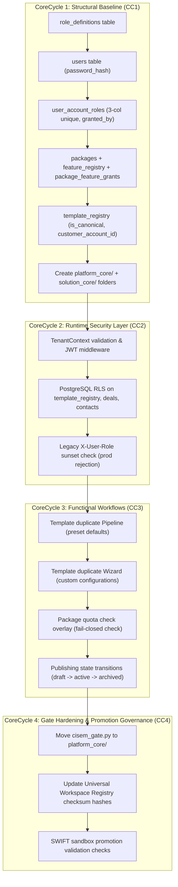

---
metadata:
  owner: "CISEM_GOVERNOR"
  canonical_location: "C:\\Users\\finky\\Desktop\\AntiGravity\\Cisem CsAg\\2026-08-10__Gemini3.5__YarivHuman__CoreSpiralDecouplingImplementationPlan__V1.1.md"
  artifact_status: "DRAFT"
  maturity: "PROPOSAL"
  version: "1.1"
  role_type: "CORE_SPIRAL_PLAN"
  author: "Gemini 3.5 (Antigravity)"
  related_axioms: ["AX-10000", "AX-20000", "AX-60000", "PR-11100", "PR-11500", "PR-13990", "AX-SPIRAL-01", "AX-SPIRAL-02", "AX-SPIRAL-03"]
  resolves_questions_from: "2026-08-10__Gemini3.5__YarivHuman__ConsolidatedResearchQuestions__V1.1.md"
---

# CoreSpiral Decoupling & Multi-Tenant Hierarchy Plan

1.1. **Introduction & Methodological Context**:
This document establishes the **Version 1.1 CoreSpiral plan** to decouple the **CISEM Deep Platform Core** from the **Universal Solution Core** and deploy the multi-tenant user hierarchy. It synthesizes and consolidates the feedback, architectural designs, and specific dissent notes from **Gemini 3.6 Flash**, **Claude Opus 4.6 (Thinking)**, and **GPT-OSS**. Following Governor instructions, CSAG is treated strictly as a temporary sandbox use-case to keep design focus on the universal platform decoupling.

1.2. **Methodology Rationale**:
Deploying user-roles join graphs, template registries, and row-level security in a single monolithic action introduces high regression risks. This plan strictly enforces the **CoreSpiral Methodology** (`AX-SPIRAL-01` to `AX-SPIRAL-03`):
- **Non-Rigid CoreCycles**: Cycles are context-defined and build outwards based on dependency inheritance.
- **Concentric Insertion**: Pillars enter, mature, and exit cycles organically rather than stretching across all milestones.
- **Maturity-Based Exit**: Verified components transition to read-only stable dependencies and exit subsequent cycles.

---

## 2. The Six Pillars of Our Architectural Challenge

2.1. **Pillar I: Multi-Tenant Identity & Account Graph Separation (Identity Schema)**:
- *Challenge*: Move from a flat single-role schema to a graph where a user can hold independent roles across multiple client accounts.
- *Consensus Resolve*: Standalone `users` table, relational `role_definitions` table (avoiding raw strings), and `user_account_roles` join table with a 3-column unique constraint.

2.2. **Pillar II: Universal Template Registry & Customization DNA (Template Registry)**:
- *Challenge*: Store canonical core template blueprints while allowing tenants to customize and publish pages safely without data leakage.
- *Consensus Resolve*: Option B (tenant-owned template records in DB with `forked_from` UUID pointers). Reusable components reside in `cisem_core/solution_core/`. Plan block-level granularity (`template_content_blocks`) for future scalability.

2.3. **Pillar III: Package Tier Gating & Enforcement Layer (Package Gating)**:
- *Challenge*: Restrict Starter, Growth, and Enterprise accounts to their quota and feature limits.
- *Consensus Resolve*: Relationally registered catalog (`feature_registry` and `package_feature_grants` join table) coupled with dynamic quota evaluation.

2.4. **Pillar IV: Dual-Core Directory Split & Compiler Gates (Directory Decoupling)**:
- *Challenge*: Decouple platform rules (`platform_core`) from solution specifications (`solution_core`) and automate verification checks.
- *Consensus Resolve*: Relocate the gate script to `platform_core/cisem_gate.py` and enforce directory rules.

2.5. **Pillar V: TenantContext Security (Context Security)**:
- *Challenge*: Propagate cryptographically signed session context to FastAPI middleware and DB-level RLS.
- *Consensus Resolve*: Complete migration to JWT-based `TenantContext` verification, deprecating the legacy `X-User-Role` header in production.

2.6. **Pillar VI: Workflow Automation (Workflow)**:
- *Challenge*: Coordinate user actions when duplication is initiated.
- *Consensus Resolve*: Deploy Pipeline mode (zero in-flight user input, default settings) and Wizard mode (multi-step UI gathering customizations).

---

## 3. CoreSpiral Pillar Registry & Lifecycle Tracking

3.1. Pillar lifecycles are explicitly tracked across cycles to prevent stubbed dependencies and capture when elements transition to stable dependencies:

| Pillar | Description | Enters | Matures | Exits |
| :--- | :--- | :--- | :--- | :--- |
| **I. Identity Schema** | `users`, `role_definitions`, `user_account_roles` tables | CC1 | CC1 | CC1 |
| **II. Template Registry** | `template_registry`, canonical/fork records, block planning | CC1 | CC3 | CC3 |
| **III. Package & Feature Gating** | `packages`, `feature_registry`, `package_feature_grants` tables | CC1 | CC3 | CC3 |
| **IV. Directory Decoupling** | Separate core directories, `cisem_gate.py` relocation | CC1 | CC1 | CC4 (validation) |
| **V. TenantContext Security** | Signed context middleware and DB-level RLS isolation | CC2 | CC2 | CC2 |
| **VI. Workflow Automation** | Wizard/Pipeline dual template copy, state transitions | CC3 | CC3 | CC3 |

---

## 4. CoreCycle Dependency Flow

4.1. The concentric flow illustrates how outer cycles inherit from and build upon locked deep-core foundations:



---

## 5. CoreCycle Execution Breakdown

### 5.1. CoreCycle 1: Structural Baseline (Schema & Directory Decoupling)
- 5.1.1. **Core Focus**: Deploy database schemas, seed data tables, and structural directories.
- 5.1.2. **Inherited Dependencies**: Existing Postgres database, [`backend/src/backend/migrations.sql`](file:///c:/Users/finky/Desktop/AntiGravity/Cisem%20CsAg/backend/src/backend/migrations.sql) (24 existing migrations).
- 5.1.3. **Active Pillars**: I (Identity Schema - enters/matures), II (Template Registry - enters), III (Package Gating - enters), IV (Directory Decoupling - enters/matures).
- 5.1.4. **Action Steps**:
  - Run SQL DDL migrations to append the following tables:
    ```sql
    -- 25. Create Role Definitions Table
    CREATE TABLE IF NOT EXISTS role_definitions (
        code VARCHAR(50) PRIMARY KEY,
        name VARCHAR(100) NOT NULL,
        description TEXT,
        created_at TIMESTAMP WITH TIME ZONE DEFAULT TIMEZONE('utc'::text, NOW()) NOT NULL
    );

    -- 26. Create Packages Table
    CREATE TABLE IF NOT EXISTS packages (
        id UUID PRIMARY KEY DEFAULT gen_random_uuid(),
        code VARCHAR(50) UNIQUE NOT NULL,
        name VARCHAR(100) NOT NULL,
        max_team_members INTEGER DEFAULT 3 NOT NULL,
        max_landing_pages INTEGER DEFAULT 5 NOT NULL,
        created_at TIMESTAMP WITH TIME ZONE DEFAULT TIMEZONE('utc'::text, NOW()) NOT NULL
    );

    -- 27. Create Feature Registry Table
    CREATE TABLE IF NOT EXISTS feature_registry (
        code VARCHAR(50) PRIMARY KEY,
        name VARCHAR(100) NOT NULL,
        description TEXT,
        created_at TIMESTAMP WITH TIME ZONE DEFAULT TIMEZONE('utc'::text, NOW()) NOT NULL
    );

    -- 28. Create Package Feature Grants Table
    CREATE TABLE IF NOT EXISTS package_feature_grants (
        id UUID PRIMARY KEY DEFAULT gen_random_uuid(),
        package_id UUID REFERENCES packages(id) ON DELETE CASCADE,
        feature_code VARCHAR(50) REFERENCES feature_registry(code) ON DELETE CASCADE,
        created_at TIMESTAMP WITH TIME ZONE DEFAULT TIMEZONE('utc'::text, NOW()) NOT NULL,
        UNIQUE(package_id, feature_code)
    );

    -- 29. Alter Customer Accounts (Link to Packages)
    ALTER TABLE customer_accounts ADD COLUMN IF NOT EXISTS package_id UUID REFERENCES packages(id) ON DELETE SET NULL;

    -- 30. Create Authenticated Users Table
    CREATE TABLE IF NOT EXISTS users (
        id UUID PRIMARY KEY DEFAULT gen_random_uuid(),
        email VARCHAR(150) UNIQUE NOT NULL,
        full_name VARCHAR(100) NOT NULL,
        password_hash VARCHAR(255) NOT NULL,
        is_active BOOLEAN DEFAULT TRUE NOT NULL,
        last_login_at TIMESTAMP WITH TIME ZONE,
        created_at TIMESTAMP WITH TIME ZONE DEFAULT TIMEZONE('utc'::text, NOW()) NOT NULL
    );

    -- 31. Create User Account Roles Join Table (Multi-Tenant Graph)
    CREATE TABLE IF NOT EXISTS user_account_roles (
        id UUID PRIMARY KEY DEFAULT gen_random_uuid(),
        user_id UUID REFERENCES users(id) ON DELETE CASCADE,
        customer_account_id UUID REFERENCES customer_accounts(id) ON DELETE CASCADE,
        role_code VARCHAR(50) REFERENCES role_definitions(code) ON DELETE CASCADE,
        granted_by UUID REFERENCES users(id) ON DELETE SET NULL,
        created_at TIMESTAMP WITH TIME ZONE DEFAULT TIMEZONE('utc'::text, NOW()) NOT NULL,
        UNIQUE(user_id, customer_account_id, role_code)
    );

    -- 32. Create Template Registry Table (Universal Solution Core)
    CREATE TABLE IF NOT EXISTS template_registry (
        id UUID PRIMARY KEY DEFAULT gen_random_uuid(),
        serial_code VARCHAR(50) UNIQUE NOT NULL,
        title VARCHAR(150) NOT NULL,
        description TEXT,
        category VARCHAR(50) NOT NULL,
        layout_spec JSONB NOT NULL,
        tags TEXT[] DEFAULT '{}'::text[] NOT NULL,
        is_canonical BOOLEAN DEFAULT FALSE NOT NULL,
        customer_account_id UUID REFERENCES customer_accounts(id) ON DELETE CASCADE,
        forked_from UUID REFERENCES template_registry(id) ON DELETE SET NULL,
        status VARCHAR(50) DEFAULT 'draft' NOT NULL,
        created_at TIMESTAMP WITH TIME ZONE DEFAULT TIMEZONE('utc'::text, NOW()) NOT NULL,
        updated_at TIMESTAMP WITH TIME ZONE DEFAULT TIMEZONE('utc'::text, NOW()) NOT NULL
    );

    -- 33. Link Internal Ownership to CRM Tables
    ALTER TABLE deals ADD COLUMN IF NOT EXISTS assigned_user_id UUID REFERENCES users(id) ON DELETE SET NULL;
    ALTER TABLE contacts ADD COLUMN IF NOT EXISTS assigned_user_id UUID REFERENCES users(id) ON DELETE SET NULL;
    ```
  - Create filesystem folder separation under `cisem_core/`:
    - Create `cisem_core/platform_core/` (Security, MCE, Ingestion, Compiler rules).
    - Create `cisem_core/solution_core/` (Templates, shared UI layouts, component specifications).
- 5.1.5. **Executable Proof**:
  - Run database migration script. Verify via query checking:
    `SELECT table_name FROM information_schema.tables WHERE table_name IN ('role_definitions', 'packages', 'feature_registry', 'package_feature_grants', 'users', 'user_account_roles', 'template_registry')`.
  - Confirm directories and `README.md` files exist on disk.

---

### 5.2. CoreCycle 2: Runtime Security Layer (TenantContext & RLS)
- 5.2.1. **Core Focus**: Build database isolation and token validation routing.
- 5.2.2. **Inherited Dependencies**: Tables created and validated in CoreCycle 1.
- 5.2.3. **Active Pillars**: V (TenantContext Security - enters/matures).
- 5.2.4. **Action Steps**:
  - Deploy FastAPI middleware extracting cryptographically signed JWT → queries `user_account_roles` → sets `current_setting('app.current_tenant_id')` and `current_setting('app.current_user_id')` in database session.
  - Inject PostgreSQL Row-Level Security (RLS) policies on `template_registry`, `user_account_roles`, `deals`, and `contacts` matching:
    `USING (customer_account_id = current_setting('app.current_tenant_id')::uuid)`.
  - Sunsets `X-User-Role` header checks. Reject requests containing this header in production environments with HTTP 400.
- 5.2.5. **Executable Proof**:
  - Execute test request to template endpoint without JWT context → assert HTTP 401.
  - Query database containing Tenant A and Tenant B templates as Tenant A context → assert zero records from Tenant B are returned.

---

### 5.3. CoreCycle 3: Functional Workflows (Pipelines, Wizards & Quota Overlays)
- 5.3.1. **Core Focus**: Implement template operations and quota check overlays.
- 5.3.2. **Inherited Dependencies**: Schema configurations (CC1) and context middleware/RLS isolation boundaries (CC2).
- 5.3.3. **Active Pillars**: II (Template Registry - matures), III (Package Gating - matures), VI (Workflow Automation - enters/matures).
- 5.3.4. **Action Steps**:
  - **Pipeline Duplication Mode**: When clicking "Use Default Template", automatically copy canonical template layout directly into tenant record (`INSERT INTO template_registry ... forked_from = parent_id, is_canonical = FALSE`), utilizing default configurations.
  - **Wizard Duplication Mode**: Gather customization configs (title, brand colors, layouts) and commit customized record to `template_registry`.
  - **Quota Enforcement Overlay**: Before duplication commits, evaluate current tenant count against packages table limit:
    `SELECT COUNT(*) FROM template_registry WHERE customer_account_id = current_tenant_id AND is_canonical = FALSE`.
    Reject creation with `QUOTA_EXCEEDED` if quota is surpassed.
  - Enforce draft/active state transitions via backend trigger limits.
- 5.3.5. **Executable Proof**:
  - Simulate copy request where tenant's template count reaches `max_landing_pages`. Assert request is blocked with `QUOTA_EXCEEDED` status code.

---

### 5.4. CoreCycle 4: Gate Hardening & Promotion Governance
- 5.4.1. **Core Focus**: Finalize workspace relocation and compiler gates.
- 5.4.2. **Inherited Dependencies**: Reconciled outputs from CoreCycles 1-3.
- 5.4.3. **Active Pillars**: IV (Directory Decoupling - validation). Pillars I, II, III, V, VI are mature and treated as stable dependencies.
- 5.4.4. **Action Steps**:
  - Relocate compiler script from `cisem_core/cisem_gate.py` to `cisem_core/platform_core/cisem_gate.py`.
  - Update `CisemSync.py` and registry hashes (`Universal_Workspace_and_Accountability_Registry`) to reflect new gate location.
  - Implement dynamic validation check verifying that sandbox modules (e.g., Supplier Scraper) contain a `PROMOTION_ELIGIBILITY.md` file checking off blast-radius constraints before promotion.
- 5.4.5. **Executable Proof**:
  - Execute `python cisem_core/platform_core/cisem_gate.py`. Assert exit code 0.

---

## 6. Architectural Anchors & Consensual Resolves

6.1. **First-Class Role Definitions**:
Bare role strings are prohibited. A normalized table `role_definitions` is created, allowing dynamic configuration of roles (`account_owner`, `team_leader`, `end_user`).

6.2. **Relational Feature Grants**:
To support auditable subscription limits, the plan rejects unstructured JSONB columns on the customer accounts table in favor of relationally mapping feature grants through a join table `package_feature_grants` linking to a validated `feature_registry`.

6.3. **Template Content Granularity**:
Although visual templates start as layout JSON columns in `template_registry`, the plan explicitly accommodates future block-level customization tracking via a planned `template_content_blocks` schema to prevent massive jsonb blob merge conflicts.

6.4. **PlanIngestor Gate Depth Check**:
The Phase 2 PlanIngestor validator is updated to inspect CoreSpiral plans for:
1. Presence of the three sub-headings (`Inherited Dependencies`, `Active Pillars`, `Executable Proof`) in every cycle.
2. Cross-cycle reference check verifying that CoreCycle N `Inherited Dependencies` explicitly lists artifacts produced in CoreCycle N-1.

---

## 7. History & Reconcile Log

- **2026-08-10 (Version 1.0)**: Initial decoupling and multi-tenant plan created by Gemini 3.5.
- **2026-08-10 (Version 1.1)**: Synthesized feedback from Gemini 3.6 Flash, Claude Opus 4.6, and GPT-OSS. Added Pillar Lifecycle Tracking table, detailed 6 pillars, and formalized consensus resolves for table-driven roles, relational features, and PlanIngestor validation enhancements. Archival log generated under `delete_plan_v1.0_evidence.json`.
