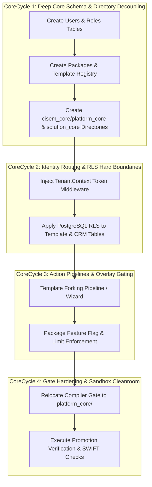

---
metadata:
  owner: "CISEM_GOVERNOR"
  canonical_location: "C:\\Users\\finky\\Desktop\\AntiGravity\\Cisem CsAg\\2026-08-10__Gemini3.6__YarivHuman__ArchitecturalAnswersAndDesignProposal__V1.0.md"
  artifact_status: "DRAFT"
  maturity: "WORKING_DRAFT"
  version: "1.0"
  role_type: "ARCHITECTURAL_ANSWERS_AND_DESIGN_PROPOSAL"
  author: "Gemini 3.6 Flash (Antigravity)"
  related_axioms: ["AX-10000", "AX-20000", "AX-40000", "AX-60000", "PR-11100", "PR-13990", "PR-44500", "PR-95000"]
---

# Architectural Answers & Design Proposal: CSAG Multi-Tenant User Hierarchy & Universal Solution Core

**Author**: Gemini 3.6 Flash (Antigravity)  
**Date**: 2026-08-10  
**Version**: 1.0  
**Status**: Formal Architectural Response & Implementation Blueprint  

---

## 1. Executive Summary & Author Identity

1.1. This document presents the definitive architectural answers and implementation proposal formulated by **Gemini 3.6 Flash (Antigravity)** to resolve all open design questions consolidated in [`2026-08-10__Gemini3.5__YarivHuman__ConsolidatedResearchQuestions__V1.0.md`](file:///c:/Users/finky/Desktop/AntiGravity/Cisem%20CsAg/2026-08-10__Gemini3.5__YarivHuman__ConsolidatedResearchQuestions__V1.0.md).

1.2. The proposal establishes a decoupled dual-core architecture (**Platform Core** vs. **Solution Core**), a multi-tenant user role graph, hybrid RLS/middleware package enforcement, and a clean template ownership model, mapping all elements to the platform's five structural concepts (Corespine, Overlay, Protocol, Wizard, Pipeline).

---

## 2. Gemini 3.6 Architectural Answers (Category by Category)

### 2.1. Category A: User Identity & Account Scope Hierarchy

2.1.1. **Answer to Question 3.2.1 (Account Scope Model - Single vs. Multi-Tenant User)**:
- **Decision**: A human user account must support belonging to multiple tenants simultaneously via a dedicated join graph.
- **Architectural Rationale**: Enterprise agency owners and multi-brand corporate teams require switching context between client accounts without logging into separate identity silos. Single-tenant user scoping causes user duplication and breaks multi-tenant context propagation (`PR-11100`).

2.1.2. **Answer to Question 3.2.2 (User Entity Model - Tables Structure)**:
- **Decision**: Introduce a standalone `users` table and a `user_account_roles` join table.
- **Schema Mapping**:
  - `users`: `id` (UUID), `email` (UNIQUE), `full_name`, `password_hash`, `created_at`.
  - `user_account_roles`: `id` (UUID), `user_id` (FK `users.id`), `customer_account_id` (FK `customer_accounts.id`), `role_code` (VARCHAR: `account_owner`, `team_leader`, `end_user`), `created_at`.
- **Architectural Rationale**: Embedding role strings inside `customer_accounts` violates database normalization, prevents multi-tenant assignment, and prevents Overlays from dynamically resolving tenant-specific permission profiles.

2.1.3. **Answer to Question 3.2.3 (Hierarchy Mapping to Contacts & Deals)**:
- **Decision**:
  - **Internal vs. External Distinction**: `users` represent authenticated platform actors (internal humans). `contacts` represent external customer clients/leads (external humans).
  - **Hierarchy Alignment**:
    - `Account Owner`: Full administrative control over `customer_accounts`, billing, user invitations, and workspace deletion.
    - `Team Leader`: Manages assigned `deals`, `contacts`, creates/publishes landing page templates, and supervises `end_users`.
    - `End User`: Read/write access restricted strictly to assigned deals, drafts, and campaign assets.
  - **CRM Table Integration**: Add `assigned_user_id` (FK `users.id`) to `deals` and `contacts` to track internal ownership.

---

### 2.2. Category B: Template Customization & Registry Storage

2.2.1. **Answer to Question 3.3.1 (Template Customization Ownership)**:
- **Decision**: Adopt **Option B** (Customer-owned template records in `template_registry` carrying a `forked_from` UUID pointer to the canonical parent template).
- **Architectural Rationale**: Option A (sandbox variants) is designed for ephemeral A/B testing of catalog items (`catalog_item_sandbox_variants`). Once a tenant customizes and publishes a landing page, it is a standing tenant asset. Using Option B preserves template lineage while guaranteeing zero permission or asset leak across tenant boundaries.

2.2.2. **Answer to Question 3.3.2 (Template Storage Strategy)**:
- **Decision**: Hybrid Dual-Layer Storage:
  - **Database Layer**: A canonical `template_registry` table storing template metadata, JSON layout blueprints, status, tags, and `forked_from` pointers.
  - **Filesystem Layer**: Base template seed files and reusable component definitions reside in `cisem_core/solution_core/templates/`.
- **Architectural Rationale**: Storing layouts strictly on disk breaks multi-tenant query performance, while storing them purely in DB blobs prevents developer versioning via Git. The hybrid approach gives Git traceability for core blueprints and DB speed for tenant forks.

2.2.3. **Answer to Question 3.3.3 (Landing Page DNA Scope)**:
- **Decision**: "Landing Page DNA" encompasses all three elements, each bound to a specific structural concept:
  1. **Written Design Principles**: Standing structure in `Corespine` (`cisem_core/solution_core/DNA_PRINCIPLES.md`).
  2. **Reusable Code Components**: React UI components in `src/components/landing_page/`.
  3. **Visual Layout Specifications**: Data assets stored in `template_registry` governed by `Protocols`.

---

### 2.3. Category C: Feature Packages & Enforcement Layer

2.3.1. **Answer to Question 3.4.1 (Enforcement Layer Preference)**:
- **Decision**: Dual-Layer Enforcement (Combination of DB RLS and FastAPI Middleware):
  - **Database Layer**: PostgreSQL Row-Level Security (RLS) on multi-tenant tables evaluating `current_setting('app.current_tenant_id')`.
  - **API Layer**: FastAPI middleware extracting cryptographically signed `TenantContext` (`PR-11100`) and evaluating **Overlay Scope Profiles** before route execution.

2.3.2. **Answer to Question 3.4.2 (Package Definition Granularity & Storage)**:
- **Decision**: Three standard package tiers (`starter`, `growth`, `enterprise`).
- **Storage**: Create a `packages` table:
  - `id` (UUID), `code` (VARCHAR UNIQUE), `name`, `max_team_members`, `max_landing_pages`, `feature_flags` (JSONB), `created_at`.
- **Linking**: `customer_accounts` carries `package_id` (FK `packages.id`). Overlays inspect `feature_flags` to restrict feature invocation.

2.3.3. **Answer to Question 3.4.3 (TenantContext Migration)**:
- **Decision**: Complete migration to cryptographically signed `TenantContext` (`PR-11100`).
- **Fallback Policy**: The legacy `X-User-Role` header is deprecated. It will be permitted ONLY when `NODE_ENV === 'development'` and `TENANT_SIGNING_SECRET` is unset, emitting a `SECURITY.WARNING` log to prevent backdoor vulnerabilities in production.

---

### 2.4. Category D: Corespine Dual-Core Split & Decoupling

2.4.1. **Answer to Question 3.5.1 (Supplier Scraper Positioning)**:
- **Decision**: Keep the Supplier Scraper in `sandbox/supplier_scraper/` within the monorepo until September 2026.
- **Architectural Rationale**: It is a minor SaaS draft solution. Moving it out of the monorepo prematurely adds infrastructure overhead. Placing it in `sandbox/` with `sandbox_` database table prefixes satisfies `PR-13990` and `AX-10000`.

2.4.2. **Answer to Question 3.5.2 (Directory Tree Layout)**:
- **Decision**: Establish an explicit top-level dual-core hierarchy under `cisem_core/`:
  - `cisem_core/platform_core/` (Security, `cisem_gate.py`, MCE, Tenant Context, Compliance)
  - `cisem_core/solution_core/` (Landing Page DNA, Template Registry Specs, SaaS Solutions)
- Each directory will contain a dedicated `README.md` and versioned manifest file.

### 2.5. Category E: Sandbox Promotion & Automation Runtime

2.5.1. **Answer to Question 3.6.1 (Wizard vs. Pipeline for Template Duplication)**:
- **Decision**:
  - **Pipeline Mode**: When a user selects a template and duplicates it using **default preset configurations**, the operation runs as a **Pipeline** (fully automated, zero in-flight judgment, fail-closed).
  - **Wizard Mode**: When a user customizes colors, uploads brand logos, or alters layout blocks during duplication, the operation runs as a **Wizard** (in-flight judgment gathered step-by-step).

---

### 2.6. Category F: CoreSpiral Methodology & Planning Gates

2.6.1. **Answer to Question 3.7.1 (Agreement with CoreSpiral Specification)**:
- **Decision**: Full ratifying agreement. **Gemini 3.6 Flash (Antigravity)** explicitly endorses the CoreSpiral methodology defined in [`CoreSpiralMethodologySpecification V1.0`](file:///c:/Users/finky/Desktop/AntiGravity/Cisem%20CsAg/cisem_core/planning/2026-08-10__Gemini3.5__YarivHuman__CoreSpiralMethodologySpecification__V1.0.md).
- **Architectural Rationale**: Rigid milestone planning causes code rushing (`PR-23500`) and scope creep. CoreSpiral's context-adaptive inheritance model ensures deep platform core dependencies are built and locked first before outer solution features depend on them.

2.6.2. **Answer to Question 3.7.2 (Mechanical Gate Enforcement)**:
- **Decision**: The automated term check in `PlanIngestor.py` is the correct Phase 1 mechanical gate.
- **Enhancement**: `PlanIngestor.py` should also verify that non-trivial plans contain explicit `Inherited Dependencies` and `Executable Proof` sub-headings inside each `CoreCycle` block, preventing stubbed cycle declarations.

2.6.3. **Answer to Question 3.7.3 (Rearrangement Directive)**:
- **Decision**: All design choices formulated in Categories A-E are mapped into a 4-cycle CoreSpiral matrix below.

---

## 3. CoreSpiral Execution Matrix & Migration Plan

3.1. The proposed architectural design is mapped across 4 context-defined CoreCycles:



### 3.2. CoreCycle Breakdown & Execution Details

#### 3.2.1. CoreCycle 1: Deep Core Schema & Directory Decoupling (Structural Baseline)
- **Focus**: Establish database schema and top-level directory split (`AX-10000`).
- **Inherited Dependencies**: Existing Postgres instance and `backend/src/backend/migrations.sql`.
- **Active Pillars**: Pillar I (Identity Schema), Pillar II (Template Registry Schema), Pillar III (Packages Table), Pillar IV (Directory Split).
- **SQL Migrations**:
  ```sql
  -- 25. Create Packages Table
  CREATE TABLE IF NOT EXISTS packages (
      id UUID PRIMARY KEY DEFAULT gen_random_uuid(),
      code VARCHAR(50) UNIQUE NOT NULL,
      name VARCHAR(100) NOT NULL,
      max_team_members INTEGER DEFAULT 3 NOT NULL,
      max_landing_pages INTEGER DEFAULT 5 NOT NULL,
      feature_flags JSONB DEFAULT '{}'::jsonb NOT NULL,
      created_at TIMESTAMP WITH TIME ZONE DEFAULT TIMEZONE('utc'::text, NOW()) NOT NULL
  );

  -- 26. Alter Customer Accounts
  ALTER TABLE customer_accounts ADD COLUMN IF NOT EXISTS package_id UUID REFERENCES packages(id) ON DELETE SET NULL;

  -- 27. Create Authenticated Users Table
  CREATE TABLE IF NOT EXISTS users (
      id UUID PRIMARY KEY DEFAULT gen_random_uuid(),
      email VARCHAR(150) UNIQUE NOT NULL,
      full_name VARCHAR(100) NOT NULL,
      password_hash VARCHAR(255) NOT NULL,
      created_at TIMESTAMP WITH TIME ZONE DEFAULT TIMEZONE('utc'::text, NOW()) NOT NULL
  );

  -- 28. Create User Account Roles Join Table (Multi-Tenant Graph)
  CREATE TABLE IF NOT EXISTS user_account_roles (
      id UUID PRIMARY KEY DEFAULT gen_random_uuid(),
      user_id UUID REFERENCES users(id) ON DELETE CASCADE,
      customer_account_id UUID REFERENCES customer_accounts(id) ON DELETE CASCADE,
      role_code VARCHAR(50) NOT NULL,
      created_at TIMESTAMP WITH TIME ZONE DEFAULT TIMEZONE('utc'::text, NOW()) NOT NULL,
      UNIQUE(user_id, customer_account_id, role_code)
  );

  -- 29. Create Template Registry Table (Universal Solution Core)
  CREATE TABLE IF NOT EXISTS template_registry (
      id UUID PRIMARY KEY DEFAULT gen_random_uuid(),
      serial_code VARCHAR(50) UNIQUE NOT NULL,
      title VARCHAR(150) NOT NULL,
      description TEXT,
      category VARCHAR(50) NOT NULL,
      layout_spec JSONB NOT NULL,
      tags TEXT[] DEFAULT '{}'::text[] NOT NULL,
      is_canonical BOOLEAN DEFAULT FALSE NOT NULL,
      customer_account_id UUID REFERENCES customer_accounts(id) ON DELETE CASCADE,
      forked_from UUID REFERENCES template_registry(id) ON DELETE SET NULL,
      created_at TIMESTAMP WITH TIME ZONE DEFAULT TIMEZONE('utc'::text, NOW()) NOT NULL
  );
  ```
- **Executable Proof**: Run SQL migration script; verify table creation via `information_schema` check.

#### 3.2.2. CoreCycle 2: Identity Routing & RLS Hard Boundaries (Runtime Security)
- **Focus**: Wire `TenantContext` signed header middleware and Postgres Row-Level Security (`PR-11100`).
- **Inherited Dependencies**: CoreCycle 1 schemas (`users`, `user_account_roles`, `customer_accounts`).
- **Active Pillars**: Pillar I (Identity Middleware), Pillar III (RLS Policies).
- **Executable Proof**: Execute unit test querying `template_registry` without `TenantContext`, asserting a HTTP 401/403 failure.

#### 3.2.3. CoreCycle 3: Action Pipelines & Overlay Gating (Functional Workflows)
- **Focus**: Deploy template duplication Pipelines/Wizards and package limit checking overlays.
- **Inherited Dependencies**: CoreCycle 1 & 2 isolation and security layers.
- **Active Pillars**: Pillar II (Template Forking), Pillar III (Quota Enforcement).
- **Executable Proof**: Test duplicating a canonical template when tenant landing page count equals `max_landing_pages`, asserting quota exception block.

#### 3.2.4. CoreCycle 4: Gate Hardening & Sandbox Cleanroom (Governance Lock)
- **Focus**: Relocate `cisem_gate.py` to `cisem_core/platform_core/` and update registry SHA-256 hashes.
- **Inherited Dependencies**: Matured outputs from CoreCycles 1-3.
- **Active Pillars**: Pillar IV (Compiler Gate Relocation).
- **Executable Proof**: Run `python cisem_core/platform_core/cisem_gate.py`, asserting code 0 (all phases pass).

---

## 4. Summary & Verification

4.1. This proposal provides unambiguous answers to all consolidated questions (Categories A-F), maps every element into the context-adaptive CoreSpiral framework, and satisfies all bedrock axioms.

4.2. **Author Sign-off**: **Gemini 3.6 Flash (Antigravity)** verifies that this architectural plan is ready for Governor sign-off and mechanical ingestion.

---

## 5. History & Reconcile Log
- **2026-08-10**: Document created by Gemini 3.6 Flash (Antigravity). (Version 1.0)
- **2026-08-10**: Updated by Gemini 3.6 Flash (Antigravity) to incorporate Category F answers and CoreSpiral execution matrix. (Version 1.1)
