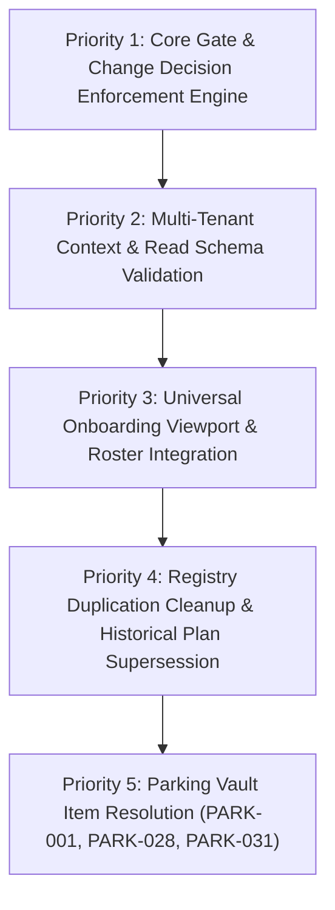

# Master Consolidated Implementation & Governance Plan V2.0

## Executive Summary & Background Context

Over the last 48 hours (August 23–25, 2026), key architectural breakthroughs, governance control fixes, and platform capabilities were established, discussed, or diagnosed across the CISEM platform. To ensure zero loss of context, complete hardwiring, and permanent alignment, this Master Plan consolidates all active, uncompleted, and proposed items into a single, prioritized, on-disk execution contract.

Nothing is omitted. Every item is assigned a priority rank based on Keystone Sequencing (*Complete what unblocks the most*), a clear containment boundary, and an explicit verification mechanism.

---

## User Review Required

> [!IMPORTANT]
> **Key Architectural Decisions for Governor Ratification**:
> 1. **State-Bearing Change Object Enforcement (`CHANGE_DECISION`)**: Ratifying the invariant `Proposed State ≠ Current State` by establishing a formal `CHANGE_DECISION` schema in `cael_status.json` that prevents diagnostic recommendations from acquiring execution authority without explicit Governor signature.
> 2. **Database Persistence for Tenant Settings (`customer_accounts.settings`)**: Hardwiring JSON schema validation on database reads (`tenant-config.schema.json`) with an automatic fallback to `default-tenant-pack` to eliminate crash risks from corrupted tenant JSON payloads.
> 3. **Formal Supersession of 40 Historical Plan Documents**: Marking 35+ historical plans created before August 10, 2026 as `SUPERSEDED_HISTORICAL_RECORD` in `ratified_plans_manifest.json` while retaining all files on disk (`RETIREMENT ≠ DELETION`).

---

## Open Questions

> [!NOTE]
> **Clarifying Questions for Governor Yariv**:
> 1. Should old coexisting registry versions in `cisem_core/` (V1.25 through V1.43) be moved to an archive subfolder `cisem_core/canon/archive/` to resolve `PARK-041`?
> 2. Do you approve ratifying `PARK-028` (Marketing & Image Processing Top Trial Run) as the next gradual trial sequence?

---

## Prioritized Implementation Roadmap (Keystone-First Sequence)

---

## Proposed Changes

---

### Priority 1: Governance Control & State-Bearing Change Object Engine

#### [MODIFY] [`cisem_core/platform_core/cisem_gate.py`](file:///C:/Users/finky/Desktop/AntiGravity/Cisem%20CsAg/cisem_core/platform_core/cisem_gate.py)
- Hardwire Phase 27 (`ChangeDecisionStateGate`): Verifies that any code or configuration edit touching active architecture references a valid `CHANGE_DECISION` object ID in `cael_status.json` with `decision_state: RATIFIED`.
- Refuse execution if a turn attempts to modify active compilation scope based solely on `PROPOSED` recommendations.

#### [MODIFY] [`AGENTS.md`](file:///C:/Users/finky/Desktop/AntiGravity/Cisem%20CsAg/AGENTS.md)
- Update Wiring Standard Gate 1.4 and `# CISEM · THE RETIREMENT QUESTION — V1` to include the `CHANGE_DECISION` referential check.

---

### Priority 2: Multi-Tenant Security & Database Read Schema Validation

#### [MODIFY] [`backend/src/backend/main.py`](file:///C:/Users/finky/Desktop/AntiGravity/Cisem%20CsAg/backend/src/backend/main.py)
- Update `GET /api/v1/tenant/members` and tenant settings handlers to validate database `customer_accounts.settings` JSONB against `src/config/schemas/tenant-config.schema.json` on read.
- Implement automatic fallback to `default-tenant-pack` and emit an audit log entry to `events` if DB settings fail schema validation.
- Enforce atomic transaction rollback if `events` table audit logging fails (`WISDOM-003`).

#### [NEW] [`src/config/schemas/tenant-config.schema.json`](file:///C:/Users/finky/Desktop/AntiGravity/Cisem%20CsAg/src/config/schemas/tenant-config.schema.json)
- Define declarative JSON schema for tenant configuration: `tenant_id`, `company_name`, `brand_color`, `default_locale`, `rtl_enabled`, `enabled_capabilities`, and `terminology`.
- Strictly disallow raw script tags, arbitrary conditions, or embedded code strings (`additionalProperties: false`).

---

### Priority 3: Universal Onboarding Viewport & App Integration

#### [MODIFY] [`src/components/views/UniversalOnboardingViewport.jsx`](file:///C:/Users/finky/Desktop/AntiGravity/Cisem%20CsAg/src/components/views/UniversalOnboardingViewport.jsx)
- Connect onboarding viewport to fetch live validated tenant settings from `/api/v1/tenant/members`.
- Render dynamic single-row header (UX Law 7.1) displaying user name, role, company, tenant ID, and active capabilities matrix.

#### [MODIFY] [`src/components/AppWrapper.jsx`](file:///C:/Users/finky/Desktop/AntiGravity/Cisem%20CsAg/src/components/AppWrapper.jsx)
- Ensure `/onboarding` route is registered and accessible via HashRouter navigation (`window.location.hash = '#/onboarding'`).

#### [MODIFY] [`src/components/layout/Sidebar.jsx`](file:///C:/Users/finky/Desktop/AntiGravity/Cisem%20CsAg/src/components/layout/Sidebar.jsx)
- Ensure `Onboarding` menu item (`Sparkles` icon) renders consistently in RTL/LTR modes.

---

### Priority 4: Registry Duplication Cleanup & Historical Plan Supersession

#### [MODIFY] [`cisem_core/planning/ratified_plans_manifest.json`](file:///C:/Users/finky/Desktop/AntiGravity/Cisem%20CsAg/cisem_core/planning/ratified_plans_manifest.json)
- Add formal supersession entries for 35+ historical plan documents, marking them as `SUPERSEDED_HISTORICAL_RECORD`.

#### [NEW] [`cisem_core/canon/archive/`](file:///C:/Users/finky/Desktop/AntiGravity/Cisem%20CsAg/cisem_core/canon/archive/)
- Archive old coexisting registry versions (V1.25 through V1.43) to resolve `PARK-041` (11 coexisting registry versions).

---

### Priority 5: Resolution of Uncompleted Parking Vault Items

#### [MODIFY] [`cisem_core/sandbox/parking_vault_draft.yaml`](file:///C:/Users/finky/Desktop/AntiGravity/Cisem%20CsAg/cisem_core/sandbox/parking_vault_draft.yaml)
- `PARK-001` (Edge cache lag): Implement client-side hydration bypass for UI theme swaps.
- `PARK-028` (Marketing & Image Processing): Register gradual trial sequence `Y-GTP-001`.
- `PARK-031` (Clarification stage protocol): Formally document clarification phase in research guidelines.

---

## Verification Plan

### Automated Tests
1. **Pre-Commit Gate Verification**:
   - Run `python cisem_core/platform_core/cisem_gate.py` to verify all 26+ phases pass 100% cleanly.
2. **Context Pack & Hash Synchronization**:
   - Run `python cisem_core/tools/update_gate_hash.py` and `python cisem_core/tools/generate_reviewer_pack.py`.
3. **API Integration Test**:
   - Execute test scripts validating JWT tenant claim resolution and JSON schema read validation on `GET /api/v1/tenant/members`.

### Manual Verification
1. **Universal Onboarding Multi-Tenant Verification**:
   - Sign in as Omri Shilo (`account_admin` at `AGN Ltd`) $\rightarrow$ Navigate to `#/onboarding` $\rightarrow$ Verify single-row header renders **Omri Shilo | account_admin | AGN Ltd**.
   - Sign in under secondary tenant context $\rightarrow$ Navigate to `#/onboarding` $\rightarrow$ Verify viewport dynamically updates company name and capability matrix without code changes.
