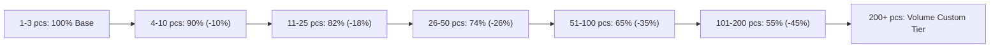
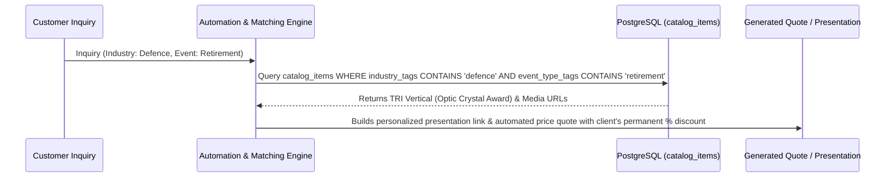

# Master Product & Pricing Engine Architecture Blueprint
**Tenant**: AGN Ltd (`customer_account_id`: `5f2bfda8-6ff1-483d-870e-14335a59915c`)  
**Target Class**: Optic Crystal Award Product Family (`TRI Vertical` & `REC Horizontal`)

---

## 1. Executive Summary & Domain Alignment

This blueprint establishes the complete multi-tiered product, variation, branding, packaging, and quantity-based pricing engine for AGN Ltd.

### Visual Reference (Sample Product Image)

---

## 2. Product Data Model & Variation Matrix

### Base Product Definition (`catalog_items`)
- **Category (Bilingual)**: `מגיני הוקרה / Recognition Awards`
- **Subcategory (Bilingual)**: `קריסטל אופטי / Optic Crystal`
- **Material**: `Solid Optic Crystal (K9 Glass)`
- **Base SKU Pattern**: `Cat# TriV_[Size]_[BrandingTech]`
- **Default Packaging**: `Blue Satin-Lined Magnetic Gift Box` (`SKU: PKG-BOX-BLUE-SATIN`)
- **SEO & Automation Tags**:
  - **Industries**: `defence`, `pharma`, `banking_finance`, `tech_saas`, `government`
  - **Event Types**: `retirement`, `excellence_award`, `deal_tombstone`, `tenure_milestone`

---

### Size & Dimensions Matrix (`product_variations` / `attributes.dimensions`)

| Size Code | Dimensions (Height x Width x Thickness) | Weight (kg) | Base Retail Price (1-3 pcs) |
| :---: | :---: | :---: | :---: |
| **S** | 100 x 80 x 20 mm | 0.4 kg | 220 ₪ |
| **M** | 120 x 90 x 22 mm | 0.6 kg | 280 ₪ |
| **L** | 150 x 100 x 30 mm | 1.0 kg | 380 ₪ |
| **XL** | 180 x 130 x 30 mm | 1.5 kg | 490 ₪ |
| **XXL** | 200 x 150 x 30 mm | 2.0 kg | 650 ₪ |
| **3XL** | 265 x 170 x 30 mm | 2.5 kg | 890 ₪ |

*Orientation Toggle*: Vertical vs. Horizontal layout supported for identical dimensions without duplicating raw material records.

---

### Branding Technology Add-On Matrix (`product_variations` / `branding_rate_cards`)

| Cat# / Technology Code | Description (Bilingual) | Price Modifier |
| :--- | :--- | :---: |
| **UV-BACK (Default)** | Full-Color UV Print on Back Surface (`הדפסת UV אחורית`) | Included in Base Price |
| **UV-FRONT** | Full-Color UV Print on Front Surface (`הדפסת UV חזיתית`) | + 35 ₪ / pc |
| **UV-DOUBLE** | Double-Sided UV Printing (Front + Back Layered) (`הדפסת UV דו-צדדית`) | + 65 ₪ / pc |
| **UV-WHITE-BASE** | Opaque White Backing Undercoat Layer (`שכבת בסיס לבן נאטם`) | + 20 ₪ / pc |
| **LASER-2D (Default)** | 2D Subsurface Laser Engraving (`חריטת לייזר פנימית 2D`) | Included in Base Price |
| **LASER-2.5D** | 2.5D Subsurface Relief Engraving (`חריטת לייזר פנימית 2.5D`) | + 45 ₪ / pc |
| **LASER-3D** | 3D Subsurface Volumetric Laser Engraving (`חריטת לייזר פנימית 3D תלת-ממדית`) | + 90 ₪ / pc |
| **MIXED-UV-LASER** | Hybrid 3D Laser Engraving + Full-Color UV Print (`משולב: לייזר 3D + הדפסת UV`) | + 120 ₪ / pc |

---

### Base Add-Ons & Base Branding Options

| Cat# / Option Code | Description | Unit Cost |
| :--- | :--- | :---: |
| **BASE-CRYSTAL** | Optic Crystal Pedestal Base (`בסיס קריסטל אופטי`) | + 85 ₪ / pc |
| **BASE-WOOD** | Solid Hardwood Pedestal Base (`בסיס עץ גושני יוקרתי`) | + 95 ₪ / pc |
| **BASE-LASER-ENGRAVE** | Laser Engraved Inscription on Base (`חריטת בלייזר על גבי הבסיס`) | + 30 ₪ / pc |
| **BASE-UV-PRINT** | Full Color UV Print on Base (`הדפסת UV על גבי הבסיס`) | + 35 ₪ / pc |

---

### Packaging Association (`packs` & `pack_items`)

| Packaging SKU | Description | Default Status | Upgrade Cost |
| :--- | :--- | :---: | :---: |
| **PKG-BOX-BLUE-SATIN** | Deluxe Blue Satin-Lined Gift Box (`קופסת מתנה מהודרת מרופדת סאטן`) | **Default (Included)** | Included (0 ₪) |
| **PKG-WOODEN-CASE-LUX** | Executive Mahogany Wood Presentation Case (`מארז עץ מהודר לפרזנטציה`) | Upgrade Option | + 110 ₪ / pc |

---

## 3. Tiered Quantity Discount Structure (`price_list_lines`)

Discount tiers automatically adjust unit price based on order volume range:

| Quantity Tier Range | Discount Off Retail Base | Example Unit Price (Size L: Base 380 ₪) |
| :--- | :---: | :---: |
| **1 – 3 pieces** | **0% (Retail)** | **380.00 ₪** |
| **4 – 10 pieces** | **10% OFF** | **342.00 ₪** |
| **11 – 25 pieces** | **18% OFF** | **311.60 ₪** |
| **26 – 50 pieces** | **26% OFF** | **281.20 ₪** |
| **51 – 100 pieces** | **35% OFF** | **247.00 ₪** |
| **101 – 200 pieces** | **45% OFF** | **209.00 ₪** |
| **200+ pieces** | **55% OFF (Volume)** | **171.00 ₪** |

---

## 4. Automated Quote & Presentation Bundling Engine Logic

1. **Inquiry Parsing**: Customer inquiry tags (e.g. `industry: defence`, `event_type: retirement`).
2. **Catalog Search**: Query `catalog_items` matching `industry_tags` and `event_type_tags`.
3. **Discount Application**:
   - `Tier_Price` computed from `price_list_lines` based on requested quantity.
   - `Client_Discount` applied from `customer_accounts.settings -> default_discount_percent` (e.g. Elbit Systems = 12% permanent account discount).
   - `Final_Unit_Price = Tier_Price * (1 - Client_Discount / 100)`.

---

## 5. Verification & Execution Strategy

1. **Seed Script Creation**: Write `cisem_core/tools/seed_agn_catalog.py` populating `catalog_items`, `product_variations`, `price_lists`, and `price_list_lines`.
2. **Schema Integrity Audit**: Validate against `live_schema_registry.json`.
3. **Governance Audit**: Run `cisem_gate.py` to ensure 100% clean gate pass.
