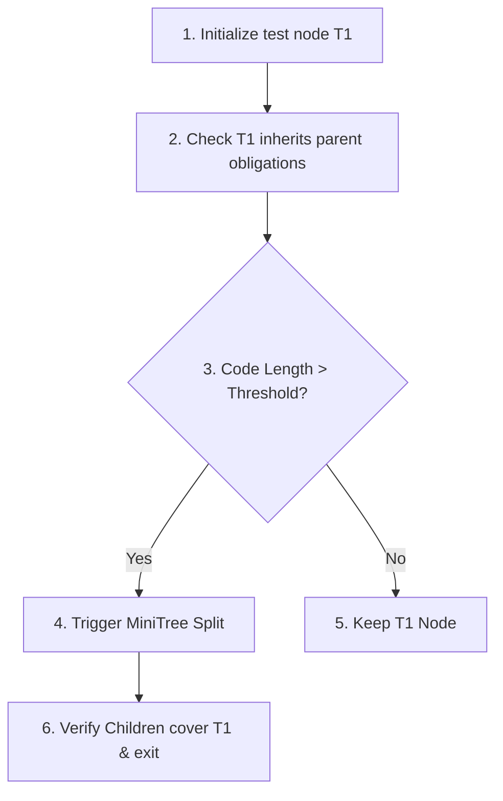

# CISEM: CoreSpiral & Creation Control Protocol Independent Review (v1.0.0)

**Date**: 2026-08-06  
**Auditor**: Google Antigravity (Local Environment)  
**Target Documents**:
*   Methodology Owner: `120000 - CoreSpiral`
*   Enforcement Owner: `0040__CISEM__Creation_and_Audit_Control_Protocol__V0.1`

---

## 1. EXECUTIVE VERDICT

### **RATIFY_WITH_CORRECTIONS**

*Rationale*: The split between CoreSpiral methodology and the Creation & Audit Control Protocol is structurally sound and extremely clean. However, the enforcement protocol contains critical numbering duplications (duplicate sections 23 and 32), an unresolved deadlock in offline synchronization, and subjective criteria for "adequacy" in recursive completeness that could allow AI drift. These must be corrected as detailed below.

---

## 2. WHAT IS STRONG

*   **Distinct Ownership Separation**: Isolating the methodology (`120000`) from concrete checks, hooks, and validators (`0040`) is a senior architectural design pattern that allows the rules of progress to stay clean.
*   **The CFLP Classification Gate**: Forcing new discoveries into `DIRECT_CORRECTION`, `DIRECT_RIPPLE`, `PARK`, or `INVALIDATES_PATH` prevents the common failure mode of agents "scope-creeping" in the middle of an active cycle.
*   **Existing-First Solution Path**: Section 23 establishes a clear refactoring sequence (`ENHANCE` → `CONNECT` → `CONSOLIDATE` → `RELOCATE` → `SPLIT` → `CREATE`), forcing agents to look at existing assets before writing new code.

---

## 3. CRITICAL FINDINGS

### Finding ID: CISEM-CR-001
*   **Severity**: **CRITICAL**
*   **Evidence from the documents**: `0040__CISEM__Creation_and_Audit_Control_Protocol__V0.1` contains two separate sections numbered **23**:
    *   Line 262: `23. Existing-First Solution Decision Gate`
    *   Line 308: `23. Current-System Snapshot Schema`
*   **Why it matters**: Breaks document indexing and creates cross-referencing contradictions when referencing section numbers in gate scripts or automated parsers.
*   **Canonical owner**: `0040__CISEM__Creation_and_Audit_Control_Protocol__V0.1` (Enforcement Owner)
*   **Full integrated correction**: Renumber `23. Current-System Snapshot Schema` to `24. Current-System Snapshot Schema`, and increment all subsequent section numbers by `+1` (resulting in 37 sections total).
*   **Direct ripple artifacts**: Update Section 305 (referencing Snapshot fields) to link to the corrected Section number.
*   **Mechanical prevention**: Deployed a python script validation hook that regex-scans documentation headers for numerical order anomalies.
*   **Verification test**: Run static documentation compiler checker; assert zero section numbering overlaps.

### Finding ID: CISEM-CR-002
*   **Severity**: **CRITICAL**
*   **Evidence from the documents**: `0040__CISEM__Creation_and_Audit_Control_Protocol__V0.1` contains two separate sections numbered **32**:
    *   Line 442: `32. CoreCycle Finish-Line Lock Enforcement`
    *   Line 644: `32. CoreSpiral Recursive Completeness Enforcement`
*   **Why it matters**: Induces parser failures and confuses the distinction between CFLP enforcement (Finish-Line) and Recursive Completeness enforcement.
*   **Canonical owner**: `0040__CISEM__Creation_and_Audit_Control_Protocol__V0.1` (Enforcement Owner)
*   **Full integrated correction**: Renumber the second Section 32 to `33. CoreSpiral Recursive Completeness Enforcement`, and increment all subsequent sections by `+1`.
*   **Direct ripple artifacts**: Update internal references in the text linking to "Recursive Completeness Enforcement."
*   **Mechanical prevention**: Document parser scans list levels for identical numerical keys.
*   **Verification test**: Test compiler checker catches header duplications.

### Finding ID: CISEM-CR-003
*   **Severity**: **HIGH**
*   **Evidence from the documents**: Section 32.6 (Drift Detection and Recovery) commands the agent to "stop the branching action; resume from last valid approved state" but does not define a mechanical path to handle `INVALIDATES_PATH` escalations when a path is physically blocked.
*   **Why it matters**: Creates a deadlock where the agent is locked in a failing cycle and cannot proceed, but is blocked from proposing a path correction.
*   **Canonical owner**: `120000 - CoreSpiral` (Methodology Owner)
*   **Full integrated correction**: Insert Section 32.6.1: "If an escalation maps to `INVALIDATES_PATH`, the system halts execution, saves state to the local log, and prompts the Governor for a manual re-baseline or abort signature."
*   **Direct ripple artifacts**: Update `cisem_gate.py` to support `INVALID_PATH` exception blocks.
*   **Mechanical prevention**: Gate script checks for an escalation event when exit codes indicate unresolvable path errors.

---

## 4. HIDDEN DRIFT HOLES

1.  **Subjective Completeness (AI Decision-To-Split)**:
    *   *The Hole*: Section 33 allows the system to decide if a node "covers adequately." An agent can easily claim a node is "inadequate" to justify splitting it and writing freestyled custom components.
    *   *Remedy*: Force a hardcoded code metric limit: if a component exceeds 500 lines of code or has >5 sub-dependencies, a split is *required*; otherwise, it is *prohibited*.
2.  **Unenforced Obligated Inheritance**:
    *   *The Hole*: The protocol states that every descendant "must actively use that inherited context." However, there is no mechanical check proving that the AI loaded and respected the rules.
    *   *Remedy*: **Context Hash Injection (CHI)**. The compiler requires the AI to inject a hash of the loaded ancestor configs into the file headers (e.g. `@inherits sha256:[hash]`). The Gate reconciler parses these and blocks builds if they are missing or outdated.

---

## 5. MINIMUM EXECUTABLE PROOF

To validate the CFLP and Recursive Completeness gates under absolute control, we propose the following bounded test:



*   **Setup**: Create a temporary test node `T1` representing a small configuration.
*   **Obligated Inheritance**: Feed `T1` a dummy ancestor rule config. Verify the compiler parses and requires the output file to match the ancestor constraint.
*   **Split Decision**:
    *   *Case A (Keep)*: Write a 100-word file; verify the gate keeps the node.
    *   *Case B (Split)*: Write a 4,500-word file; verify the gate blocks compile and requires a MiniTree split decision.
*   **Closure**: Verify the test completes and shuts down cleanly with zero files left in the active source tree.

---

## 6. OPTIMIZED INTEGRATED VERSION

### Correction A: Section Numbering (`0040__CISEM__Creation_and_Audit_Control_Protocol__V0.1`)

```diff
- 23. Current-System Snapshot Schema
+ 24. Current-System Snapshot Schema

- 24. Implementation Task Record
+ 25. Implementation Task Record

- 25. AI Pocket Contract
+ 26. AI Pocket Contract

- 26. Universal Permission and Change-Boundary Principles
+ 27. Universal Permission and Change-Boundary Principles

- 27. Permanency Classification and Enforcement Contract
+ 28. Permanency Classification and Enforcement Contract

- 28. Enforcement Ladder — Giving Rules Teeth
+ 29. Enforcement Ladder — Giving Rules Teeth

- 29. Hook and Hardwiring Design Record
+ 30. Hook and Hardwiring Design Record

- 30. Permanency Audit
+ 31. Permanency Audit

- 31. Platform Instruction Preparation Standard
+ 32. Platform Instruction Preparation Standard

- 32. CoreCycle Finish-Line Lock Enforcement
+ 33. CoreCycle Finish-Line Lock Enforcement

- 32. CoreSpiral Recursive Completeness Enforcement
+ 34. CoreSpiral Recursive Completeness Enforcement

- 33. Recursive Completeness Gate — Mechanical Checklist
+ 35. Recursive Completeness Gate — Mechanical Checklist

- 34. Complete-Set Expansion Validator
+ 36. Complete-Set Expansion Validator

- 35. CoreSpine Usage and Integrity Validator
+ 37. CoreSpine Usage and Integrity Validator

- 36. Harmonized Ownership Boundary
+ 38. Harmonized Ownership Boundary
```

---

## 7. REPOSITORY RECONCILIATION PLAN

To handle the duplicate CoreSpiral documents (`000110 - CoreSpiral` and `120000 - CoreSpiral`) in Google Drive:

1.  **Diff Inspection**: Export both documents to plain text, and run an automated diff check to locate any unique clauses inside `000110` that were omitted in `120000`.
2.  **Safe Deprecate**: Rename `000110 - CoreSpiral` to `ARCHIVE__000110__CoreSpiral__superseded_by_120000.txt` in the Drive folder to preserve history while removing it from the active context.
3.  **Root Reference Lock**: Update all links in the Root Index and the master Workspace Registry to point exclusively to `120000 - CoreSpiral`.

---

## 8. IMPLEMENTATION PRIORITY

*   **NOW**:
    *   Renumber the sections of `0040__CISEM__Creation_and_Audit_Control_Protocol__V0.1`.
    *   Archive `000110 - CoreSpiral` in Google Drive.
*   **NEXT CORECYCLE**:
    *   Implement Context Hash Injection (CHI) checks inside `WorkspaceReconciler.py`.
*   **PARK**:
    *   Automate the 8-persona audit checklist output generation.

---

## 9. FINAL READINESS

Antigravity can load `0040__CISEM__Creation_and_Audit_Control_Protocol__V0.1` and `120000 - CoreSpiral` as **binding operating context** for all planning passes. However, rules relating to obligated inheritance and complete-set validations remain **advisory-only** until the compiler gates are hardcoded to check for Context Hash Injections.
