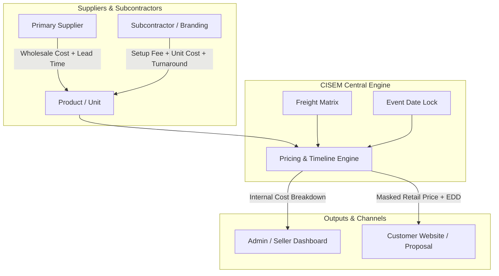

# CISEM Product, Supplier, Cost & Delivery Time Wiring Model

---
metadata:
  owner: "CISEM_GOVERNOR"
  canonical_location: "C:\\Users\\finky\\.gemini\\antigravity\\brain\\f9d83031-b7e1-42a3-adc3-5130cf5cb069\\2026-08-22__CISEM__Product_Supplier_Cost_Delivery_Wiring_Model__V1.0.md"
  artifact_status: "RATIFIED_SPECIFICATION"
  maturity: "ARCHITECTURAL_BLUEPRINT"
  version: "1.0"
  governor_signature: "GOV-YARIV-20260822-COST-DELIVERY-WIRING-V1.0"
---

## 1. Executive Summary & Core Intent

1.1. **Objective**: This document provides a comprehensive research summary and architectural blueprint for unifying **Products**, **Suppliers**, **Customers**, **E-Commerce Websites**, **Multi-Tier Costs**, and **Production Delivery Times** within the CISEM platform.

1.2. **The Core Problem**: Traditional e-commerce platforms store static product prices and fixed lead times. Real-world manufacturing and B2B procurement require dynamic pricing based on order volumes, multi-supplier sourcing, subcontractor work-center routing, geographic freight zones, and calendar feasibility checks against customer event deadlines.

1.3. **Scope**: Synthesizes current CISEM code/schema capabilities, industry benchmarks from open-source ERP/e-commerce systems (MedusaJS, ERPNext, Odoo, Shopify), and factory flow management frameworks (MRP II, MES, Theory of Constraints) into an integrated CISEM domain model.

---

## 2. Current State Analysis: What Already Exists in CISEM

### 2.1. Cost Wiring & Pricing Engine
- **Database Schema**:
  - [`cisem_core/live_schema_registry.json:58`](file:///C:/Users/finky/Desktop/AntiGravity/Cisem%20CsAg/cisem_core/live_schema_registry.json#L58): `supplier_mappings` records `wholesale_cost`, `currency`, `supplier_sku`, `supplier_product_url`.
  - [`cisem_core/live_schema_registry.json:62`](file:///C:/Users/finky/Desktop/AntiGravity/Cisem%20CsAg/cisem_core/live_schema_registry.json#L62): `branding_rate_cards` records subcontractor quantity brackets (`min_quantity`, `max_quantity`, `setup_fee`, `unit_cost`).
  - [`cisem_core/live_schema_registry.json:25`](file:///C:/Users/finky/Desktop/AntiGravity/Cisem%20CsAg/cisem_core/live_schema_registry.json#L25): `quote_lines` records line-item snapshot `quantity`, `unit_price`, `cost_breakdown` (internal admin cost detail), and `description` (customer-facing text).
- **Backend Pricing Logic**:
  - [`backend/src/backend/pricing_engine.py:29-60`](file:///C:/Users/finky/Desktop/AntiGravity/Cisem%20CsAg/backend/src/backend/pricing_engine.py#L29-L60): `calculate_quote_pricing` computes unit cost by amortizing setup fees and freight per unit:
    $$\text{Unit Cost} = \text{Wholesale Cost} + \text{Subcontractor Unit Cost} + \frac{\text{Setup Fee}}{\text{Quantity}} + \frac{\text{Freight Cost}}{\text{Quantity}}$$
    $$\text{Client Unit Price} = \frac{\text{Unit Cost}}{1 - \text{Margin Percent}}$$

### 2.2. Delivery Time & Timeline Feasibility
- **Database Schema**:
  - [`cisem_core/live_schema_registry.json:32`](file:///C:/Users/finky/Desktop/AntiGravity/Cisem%20CsAg/cisem_core/live_schema_registry.json#L32): `catalog_items` stores `supplier_lead_time_days`.
  - [`cisem_core/live_schema_registry.json:62`](file:///C:/Users/finky/Desktop/AntiGravity/Cisem%20CsAg/cisem_core/live_schema_registry.json#L62): `branding_rate_cards` stores `turnaround_days`.
- **Backend Feasibility Logic**:
  - [`backend/src/backend/pricing_engine.py:62-74`](file:///C:/Users/finky/Desktop/AntiGravity/Cisem%20CsAg/backend/src/backend/pricing_engine.py#L62-L74): `check_timeline_feasibility` evaluates:
    $$\text{Total Production Days} = \text{Supplier Lead Time Days} + \text{Subcontractor Turnaround Days}$$
    $$\text{Feasibility} = \begin{cases} \text{"FEASIBLE"} & \text{if } \text{Days to Event} \ge \text{Total Production Days} + 3 \\ \text{"TIGHT_TIMELINE"} & \text{if } \text{Total Production Days} \le \text{Days to Event} < \text{Total Production Days} + 3 \\ \text{"INFEASIBLE"} & \text{if } \text{Days to Event} < \text{Total Production Days} \end{cases}$$

---

## 3. Industry Benchmarks: E-Commerce Platforms vs. Factory Flow Management

### 3.1. E-Commerce Platforms (MedusaJS, Shopify, Odoo, ERPNext)
- **Multi-Supplier Sourcing**:
  - Modern ERPs link a single Product SKU to multiple Supplier Items, each with supplier-specific minimum order quantities (MOQ), lead times, and tier pricing.
  - Primary supplier is selected automatically based on lowest landed cost or shortest lead time.
- **Dynamic Freight & Carrier Integration**:
  - Freight costs are determined by Carrier API matrix (Weight $\times$ Distance Zone + Handling Fee) rather than fixed flat rates.
- **Promise-To-Delivery (PTD) Calculation**:
  $$\text{EDD (Estimated Delivery Date)} = \text{Order Date} + \text{Fulfillment Processing} + \text{Carrier Transit Days} + \text{Buffer Days}$$

### 3.2. Factory Production Flow Management (MRP II, MES, Theory of Constraints)
- **Bill of Materials (BOM) & Work Center Routing**:
  - Production factories break manufacturing into multi-stage operations (Work Centers):
    1. *Material Procurement*: Sourcing raw components from suppliers.
    2. *Queue & Setup*: Machine preparation and setup time.
    3. *Run Time*: Production time proportional to quantity ($\text{Run Time} = \text{Quantity} \times \text{Cycle Time per Unit}$).
    4. *Quality Control & Packaging*: Inspection and final boxing.
    5. *Inbound/Outbound Freight*: Logistics transit.
- **Theory of Constraints (TOC) & Buffer Management**:
  - Bottleneck Work Centers dictate total factory throughput.
  - A dynamic "Time Buffer" is added to protect customer delivery dates against machine breakdowns or shipping delays.

---

## 4. Unified CISEM Product-Supplier-Customer Cost & Delivery Model



### 4.1. The Complete Cost Equation
For any product (or composite bundle of products), the Total Landed Unit Cost ($C_{\text{landed}}$) and Retail Client Price ($P_{\text{client}}$) are computed dynamically:

$$C_{\text{landed}} = C_{\text{wholesale}} + C_{\text{branding\_unit}} + \frac{F_{\text{setup}}}{Q} + \frac{C_{\text{freight\_zone}}}{Q} + C_{\text{tariff}}$$

$$P_{\text{client}} = \frac{C_{\text{landed}}}{1 - M_{\text{target}}}$$

Where:
- $C_{\text{wholesale}}$ = Base wholesale cost from selected supplier mapping.
- $C_{\text{branding\_unit}}$ = Per-unit branding cost from matching quantity bracket.
- $F_{\text{setup}}$ = One-time setup fee from subcontractor rate card.
- $C_{\text{freight\_zone}}$ = Shipping cost determined by delivery zone.
- $Q$ = Total order quantity.
- $M_{\text{target}}$ = Target profit margin percentage.

### 4.2. The Complete Delivery Time Equation
The total lead time from order confirmation to customer doorstep ($T_{\text{total}}$) is calculated using factory routing operations:

$$T_{\text{total}} = T_{\text{supplier\_procurement}} + \sum_{i=1}^{n} \left( T_{\text{setup\_i}} + (Q \times T_{\text{cycle\_i}}) \right) + T_{\text{freight\_transit}} + T_{\text{safety\_buffer}}$$

Where:
- $T_{\text{supplier\_procurement}}$ = Supplier lead time (days).
- $T_{\text{setup\_i}}$ = Work center setup time (days).
- $T_{\text{cycle\_i}}$ = Production run time per unit at work center $i$.
- $T_{\text{freight\_transit}}$ = Geographic carrier transit time (days).
- $T_{\text{safety\_buffer}}$ = Dynamic safety buffer based on delivery risk factor.

---

## 5. Schema & API Extension Blueprint

### 5.1. SQL Schema Extensions DDL
To support multi-supplier pricing brackets, dynamic UOMs, and work center routing, the following database tables are specified for implementation:

```sql
-- 1. Supplier Lead Time & Cost Brackets Table
CREATE TABLE IF NOT EXISTS public.supplier_cost_brackets (
    id UUID PRIMARY KEY DEFAULT gen_random_uuid(),
    supplier_mapping_id UUID NOT NULL REFERENCES public.supplier_mappings(id) ON DELETE CASCADE,
    min_quantity NUMERIC(12,4) NOT NULL DEFAULT 1,
    max_quantity NUMERIC(12,4) NOT NULL DEFAULT 999999,
    wholesale_cost NUMERIC(12,2) NOT NULL,
    lead_time_days INT NOT NULL DEFAULT 5,
    created_at TIMESTAMPTZ NOT NULL DEFAULT NOW()
);

-- 2. Work Center Operations & Production Flow Table
CREATE TABLE IF NOT EXISTS public.work_center_operations (
    id UUID PRIMARY KEY DEFAULT gen_random_uuid(),
    customer_account_id UUID REFERENCES public.customer_accounts(id),
    operation_code VARCHAR(64) NOT NULL,
    work_center_name VARCHAR(128) NOT NULL,
    setup_fee NUMERIC(12,2) NOT NULL DEFAULT 0.00,
    unit_cost NUMERIC(12,2) NOT NULL DEFAULT 0.00,
    setup_days INT NOT NULL DEFAULT 1,
    cycle_days_per_100_units NUMERIC(8,2) NOT NULL DEFAULT 0.5,
    is_active BOOLEAN NOT NULL DEFAULT TRUE
);

-- 3. Geographic Freight Delivery Zones Table
CREATE TABLE IF NOT EXISTS public.freight_zone_rates (
    id UUID PRIMARY KEY DEFAULT gen_random_uuid(),
    zone_code VARCHAR(64) NOT NULL,
    zone_name VARCHAR(128) NOT NULL,
    base_freight_cost NUMERIC(12,2) NOT NULL,
    transit_days INT NOT NULL DEFAULT 2,
    customer_account_id UUID REFERENCES public.customer_accounts(id)
);
```

### 5.2. API Endpoint Specification
- `POST /api/v1/pricing/calculate-matrix`: Accepts order quantity, product SKU, delivery postal code/zone, and event date; returns landed cost breakdown, retail pricing tiers, and feasibility timelines.
- `GET /api/v1/products/{sku}/delivery-estimate`: Returns estimated delivery date (EDD) ranges for website display.

---

## 6. Verification & Implementation Roadmap

| Phase | Milestone | Deliverable | Proof of Verification |
| :--- | :--- | :--- | :--- |
| **Phase 1** | Schema Extensions | Apply `supplier_cost_brackets` & `freight_zone_rates` DDL | `live_schema_registry.json` update & migration ledger entry |
| **Phase 2** | Pricing Engine Refactor | Update `pricing_engine.py` to evaluate UOM & multi-stage lead time | Unit tests passing with variable quantities (meters/kg/units) |
| **Phase 3** | Admin & Website UI Wiring | Expose UOM selector in `AddItemModal.jsx` & EDD in proposals | Visual rendering of retail price vs internal cost breakdown |

---

## 7. Governance Ratification & Sign-off

This artifact serves as the official CISEM architecture specification for product cost and delivery wiring. All implementation steps must be executed via ratified plans carrying the `GOV-YARIV-20260822-COST-DELIVERY-WIRING-V1.0` signature.
