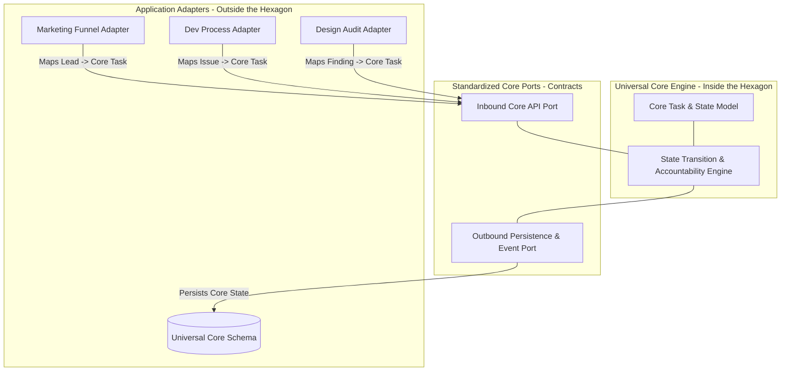
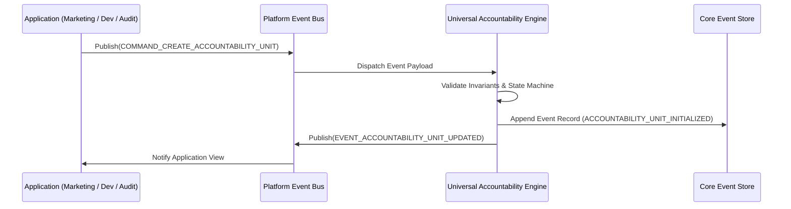

# Research Report: Battle-Tested Architectures for Universal Core vs. Application Feature Isolation

---
metadata:
  owner: "CISEM_GOVERNOR"
  canonical_location: "C:\\Users\\finky\\.gemini\\antigravity\\brain\\f9d83031-b7e1-42a3-adc3-5130cf5cb069\\2026-08-22__CISEM__Core_Capability_vs_Application_Isolation_Architectures__V1.0.md"
  artifact_status: "RESEARCH_BLUEPRINT"
  maturity: "ARCHITECTURAL_RESEARCH"
  version: "1.0"
  governor_signature: "GOV-YARIV-20260822-CORE-ISOLATION-RESEARCH-V1.0"
---

## 1. Executive Summary & Core Dilemma

1.1. **The Dilemma**: When a platform builds a generic capability (such as Task Management, Accountability Tracking, Audit Logging, or Workflow Orchestration), it faces a classic architectural risk:
- If built for **one specific application** (e.g. employee task management), it becomes tightly coupled to that single use case, rendering it unusable for other domains (marketing funnels, dev processes, design audits).
- If modified incrementally to support new applications, developers leak application-specific columns, flags, and assumptions into the shared data model, corrupting the universal core.

1.2. **Objective**: This research presents the top 4 battle-tested, enterprise-grade software architectures designed specifically to create a **thick mechanical wall** between a Universal Core Capability and external application consumers, preventing feature leakages.

---

## 2. Methodology 1: Ports & Adapters Architecture (Hexagonal Architecture)



### 2.1. Mechanism & Principles
- **Alistair Cockburn's Hexagonal Architecture**: The core capability engine resides inside a closed boundary ("The Hexagon").
- **Zero Inward Dependencies**: The Core Domain Model carries **ZERO dependencies** on external frameworks, UI stores, or application-specific data types.
- **Inbound Ports (Interfaces)**: Standardized method contracts (`create_task_unit()`, `transition_state()`, `assign_accountability()`).
- **Application Adapters**: External domain applications (Marketing, Dev, Design) write thin adapter layers that translate domain-specific entities (e.g. `MarketingLead` or `AuditFinding`) into generic Core Port payloads before calling the Core.

### 2.2. Mechanical Leakage Prevention
- **Structural Immutability**: Application code cannot alter Core data structures because the Core engine code sits in an independent, read-only module (`cisem_core/capabilities/task_engine/`).
- **Static Analysis Enforcement**: Lint rules prevent any file inside `cisem_core/capabilities/` from importing files from application directories (`src/components/views/` or `src/stores/`).

---

## 3. Methodology 2: Microkernel & Extension Overlay Architecture

### 3.1. Mechanism & Principles (OSGi / Eclipse / Shopify App Model)
- **Minimal Immutable Core**: The core data table contains only universally invariant fields:

```sql
CREATE TABLE core.universal_tasks (
    id UUID PRIMARY KEY DEFAULT gen_random_uuid(),
    tenant_id UUID NOT NULL,
    domain_type VARCHAR(64) NOT NULL, -- e.g. 'MARKETING', 'DEVELOPMENT', 'DESIGN_AUDIT'
    subject_reference VARCHAR(255) NOT NULL,
    current_status VARCHAR(64) NOT NULL,
    accountable_actor_id UUID NOT NULL,
    attributes JSONB NOT NULL DEFAULT '{}'::jsonb, -- Schema-less extension overlay
    created_at TIMESTAMPTZ NOT NULL DEFAULT NOW()
);
```

- **Domain Extension Overlays**: Applications that require additional fields (e.g., `budget_ils` for Marketing, `git_commit_sha` for Dev) store their custom attributes inside the schema-less `attributes` JSONB container OR in separate application-owned extension tables:

```sql
CREATE TABLE app_dev.task_git_metadata (
    task_id UUID PRIMARY KEY REFERENCES core.universal_tasks(id) ON DELETE CASCADE,
    git_commit_sha VARCHAR(64) NOT NULL,
    build_target VARCHAR(128) NOT NULL
);
```

### 3.2. Mechanical Leakage Prevention
- **Schema Isolation**: The core table (`core.universal_tasks`) is locked against DDL modifications (`ALTER TABLE`).
- Applications extend functionality by adding **ROWS** to `core.universal_tasks` and **TABLES** in their own application schema (`app_dev.*`), never by modifying core columns.

---

## 4. Methodology 3: Event-Driven Capability Engines (CQRS & Event Sourcing)



### 4.1. Mechanism & Principles
- **Headless Execution**: The Universal Core Capability runs as a headless, asynchronous event-processing engine.
- **Command / Event Contract**: Applications communicate with the Core engine strictly via cryptographically validated Event Payloads (`COMMAND_CREATE_TASK`, `COMMAND_ASSIGN_RESPONSIBILITY`, `COMMAND_TRANSITION_STATUS`).

### 4.2. Mechanical Leakage Prevention
- **Physical Boundary Isolation**: The application and the core capability engine do not share memory or UI state. They interact exclusively over the event bus.
- Application-specific parameters are encapsulated inside event payloads. If an application payload contains invalid or unapproved attributes, the Core engine ignores them during command evaluation.

---

## 5. Methodology 4: PostgreSQL Schema Isolation & Event Trigger Locks

### 5.1. Mechanism & Principles
- **Database Schema Partitioning**:
  - `core.*`: Universal platform schemas (`core.tasks`, `core.users`, `core.accountability_ledger`).
  - `app_*`: Domain-specific application schemas (`app_crm.*`, `app_marketing.*`).
- **PostgreSQL Event Triggers**: A server-side database event trigger physically intercepts and blocks any DDL statement attempting to modify `core.*` tables unless executed under a ratified superuser session token:

```sql
CREATE OR REPLACE FUNCTION core.prevent_core_schema_alteration()
RETURNS event_trigger AS $$
BEGIN
  IF current_setting('cisem.allow_core_ddl', true) IS DISTINCT FROM 'true' THEN
    RAISE EXCEPTION 'CISEM CORE IMMUTABILITY VIOLATION: Core schema alterations are mechanically prohibited.';
  END IF;
END;
$$ LANGUAGE plpgsql;

CREATE EVENT TRIGGER lock_core_schema ON ddl_command_start
WHEN TAG IN ('ALTER TABLE', 'DROP TABLE', 'ALTER COLUMN')
EXECUTE FUNCTION core.prevent_core_schema_alteration();
```

---

## 6. Comparative Evaluation Matrix

| Methodology | Thick Wall Isolation | Implementation Complexity | Reusability Across Domains | Mechanical Leakage Prevention |
| :--- | :--- | :--- | :--- | :--- |
| **1. Ports & Adapters** | High (Code Module Boundary) | Medium | Excellent | High (Compiler / Import Lint Checks) |
| **2. Microkernel & Overlays** | High (Database Schema Boundary) | Low | Excellent | High (Schema DDL Lock) |
| **3. Event-Driven CQRS** | Extreme (Headless Bus Isolation) | High | Maximum | Maximum (Physical Process Boundary) |
| **4. DB Event Triggers** | Maximum (Database Engine Lock) | Low | High | Maximum (Hard SQL Exception) |

---

## 7. Recommended CISEM Synthesis Architecture

7.1. **The Combined Hybrid Pattern**:
To provide maximum protection against feature leakage while supporting internal dev workflows, marketing funnels, and design audits, CISEM should combine:
1. **Microkernel Core Table** (`core.universal_tasks`): Generic entity with `domain_type`, `status`, `actor_id`, and schema-less `attributes` JSONB overlay.
2. **Ports & Adapters Module Boundary**: Place core engine logic in `cisem_core/capabilities/task_engine/`. Enforce ESLint import linters preventing imports from `src/components/views/`.
3. **Database DDL Event Trigger**: Enforce `lock_core_schema` event trigger in PostgreSQL to block unratified DDL edits.

---

## 8. Document Reporting & Download Links

- *Full Filename*: [`cisem_core/live_schema_registry.json`](file:///C:/Users/finky/Desktop/AntiGravity/Cisem%20CsAg/cisem_core/live_schema_registry.json)
- *Active Version*: `Version 1.0`
- *Clickable Link*: [live_schema_registry.json](file:///C:/Users/finky/Desktop/AntiGravity/Cisem%20CsAg/cisem_core/live_schema_registry.json)
- *Download Link*: [Download live_schema_registry.json](http://localhost:3000/api/download?filename=cisem_core/live_schema_registry.json)

---

## 9. Next-Step Recommendation

I **RECOMMEND** that Governor Yariv review this architectural research report and decide whether to ratify an implementation plan to create the `core.universal_tasks` schema and its corresponding Ports & Adapters module in `cisem_core/capabilities/task_engine/`.
