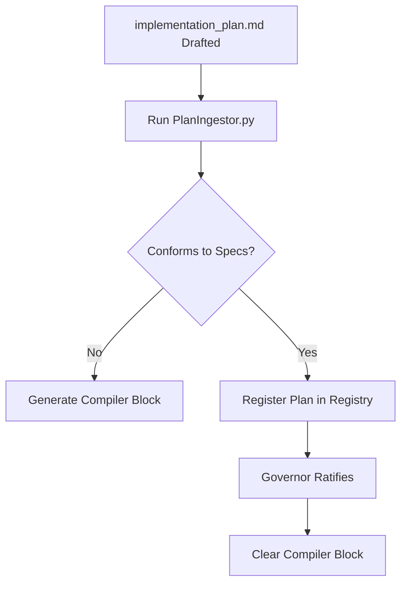

# CISEM Planning Subsystem Specification

---
metadata:
  owner: "CISEM_GOVERNOR"
  canonical_location: "C:\\Users\\finky\\Desktop\\AntiGravity\\Cisem CsAg\\cisem_core\\planning\\2026-08-07__CISEM__Planning__Specification__V1.0.md"
  artifact_status: "DRAFT"
  maturity: "WORKING_DRAFT"
  version: "1.0"
  inherited_authorities:
    - "CISEM Project Constitution"
  related_implementation_adapter: "GOOGLE_ANTIGRAVITY_ADAPTER"
  local_edits_allowed: false
  role_type: "CANONICAL_PLANNING_SPECIFICATION"
---

## 1. Principles & Goals

The **CISEM Planning Subsystem (`CISEM_PLANNING`)** enforces the **Contractual Ingestion Principle (CIP)**: no codebase modification may occur without a ratified design contract (design plan). 

To prevent execution drift, planning document metadata and sections must be programmatically verified before promotion to the core registry.

---

## 2. Plan Document Metadata Schema

Every plan file (`implementation_plan.md`) must begin with a YAML frontmatter block containing:

```yaml
plan_id: "CISEM-IP-YYYYMMDD-DESCRIPTION"
title: "Plan Title"
version: "V1.0"
governor_signature: "GOV-YARIV-YYYYMMDD-DESCRIPTION-V1.0"
blast_radius: "LOW | MEDIUM | HIGH"
axioms_linked:
  - "AX-10000"
  - "PR-95000"
```

### Constraints:
- **`plan_id`**: Checked against regex pattern `^CISEM-IP-\d{8}-[A-Z0-9-]+$`.
- **`governor_signature`**: Enforced on ratified items, validated against signature registry patterns.
- **`axioms_linked`**: Must map to parent axioms in `AxiomsAndPrinciples.md`.

---

## 3. Required Heading Structure

Every design plan must contain the following five headings exactly:

1. `# [Goal Description]` (1st-level heading describing the business goal).
2. `## User Review Required` (Highlighting potential risks or structural edits).
3. `## Open Questions` (Presenting design decisions or trade-offs for the Governor).
4. `## Proposed Changes` (Listing affected files categorized by `[NEW]`, `[MODIFY]`, or `[DELETE]`).
5. `## Verification Plan` (Defining automated verification commands and manual validations).

---

## 4. Verification & Ingestion Lifecycle

The plan validation pipeline operates as follows:



1. **Drafting**: The AI developer drafts `implementation_plan.md`.
2. **Parsing**: The `PlanIngestor.py` utility parses the plan, validating metadata, headings, and parent axioms.
3. **Registering**: If clean, the plan state updates to `RATIFIED_PENDING`. If malformed, the script writes a `.gate_lock` and blocks compiler runs.
4. **Promotion**: Once the Governor approves the plan in the chat loop, the signature is registered, clearing the gate.
