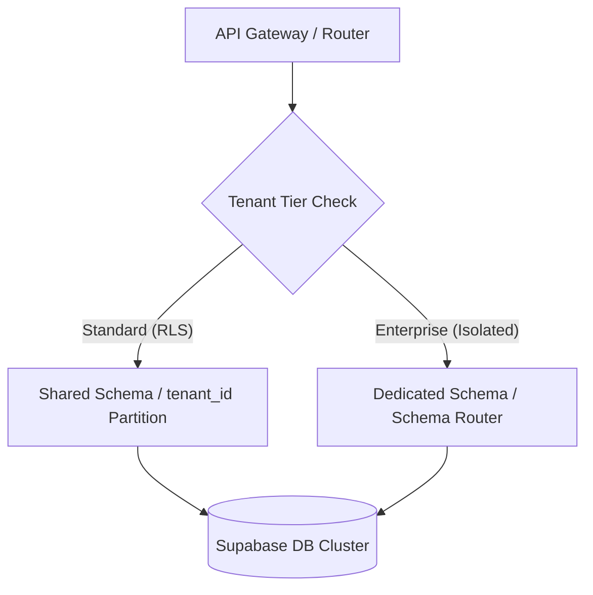

---
metadata:
  owner: "CISEM_GOVERNOR"
  canonical_location: "C:\\Users\\finky\\Desktop\\AntiGravity\\Cisem CsAg\\cisem_core\\planning\\2026-08-08__AntigravityLocal__YarivHuman__EnterpriseScaleArchitectureBlueprint__V1.0.md"
  artifact_status: "DRAFT"
  maturity: "PROPOSAL"
  version: "1.0"
  inherited_authorities: []
  related_axioms: ["AX-10000", "PR-11000", "PR-13500"]
---

# Enterprise Scale & Multi-Tenant Architecture Blueprint

1.1. **Introduction & Architectural Context**:
This document outlines the long-term architectural strategy for the Commark UBOP platform to support massive multi-tenant scale, concurrent team developer workflows, and the lifecycle of promoting code from sandbox exploration to production core.

1.2. **The "Nothing Stands Alone" Axiom**:
Every script, database partition, or UI module in the platform is a node in a connected system. To prevent fragmentation, duplication, and registry debt under high developer velocity, the system defines explicit boundaries, data pathways, and promotion triggers.

---

## 2. Multi-Tenant Scale & Database Partitioning

2.1. **Logical vs. Physical Isolation**:
To support thousands of concurrent tenants, teams, and individuals, the data layer utilizes a hybrid partitioning architecture in Supabase (PostgreSQL):
- **Row-Level Security (RLS) by Tenant**: High-density tenants are co-located in shared tables (e.g., `workspaces`, `deals`) partitioned logically via `tenant_id` and indexed with PostgreSQL row-level security.
- **Physical Schema Partitioning**: Enterprise tenants requiring strict compliance and isolation are assigned dedicated PostgreSQL schemas within the same database cluster or separate server instances, managed dynamically via an API routing registry.



2.2. **Vector Space Scaling (PGVector)**:
To prevent similarity search crossover and query latency degradation under heavy load:
- **Tenant-Partitioned Vector Lists**: High-density index lists (`product_embeddings`) are filtered strictly via composite keys `(tenant_id, embedding_id)`.
- **Decoupled Search Nodes**: Similarity-matching requests (`match_product_embeddings`) run in read-only database replicas to protect the write performance of transactional systems.

---

## 3. The Sandbox Lifecycle: Iterative Exploration vs. Core Promotion

3.1. **The Nature of the Sandbox**:
The sandbox is a high-velocity playground. It is expected to become messy and filled with ad-hoc patches because its primary value is rapid intent validation and feature gestation. 

3.2. **Refactor vs. Rewrite-from-Scratch Matrix**:
When a sandbox feature matures and is ready for promotion to production core, we apply a strict architectural decision matrix to select the migration path:

| Criteria | Path A: Refactor & Clean | Path B: Rewrite From Scratch (Recommended) |
| :--- | :--- | :--- |
| **Architectural Drift** | UI logic matches backend state; low database schema delta. | Core data flow changed; many ad-hoc patches; database hacks introduced. |
| **API Quality** | Clean REST patterns; clear error handlers. | Hardcoded endpoints; nested callbacks; high technical debt. |
| **Performance Delta** | Fast response rates; optimal query profiles. | Heavy database loops; duplicate queries; blocking calculations. |
| **VCS Cleanliness** | Small contiguous diff blocks. | Fragmented files scattered across multiple sub-directories. |

3.3. **The Promotion Protocol (Transitioning from Sandbox to Core)**:
To promote a feature from the sandbox:
1. **Design Contract Ratification**: Create an implementation plan specifying the clean interfaces, TS types, and DB schemas.
2. **Clean Room Construction**: Build the feature from scratch in the core (`/src` and `/backend`) according to the plan, using the sandbox code strictly as a logical reference.
3. **Mechanical Gate Verification**: Run `cisem_gate.py` locally to verify 5-digit sparse IDs, references, and registry SHA256 checksums.
4. **Sandbox Pruning**: Delete the experimental sandbox file, logging its removal in the cleanup log.

---

## 4. The Workspace Layout System

4.1. **Dedicated Spaces for Separate Concerns**:
To organize the platform cleanly so that every module has a defined home, the repository layout is structured into five distinct layers:

```
[Repository Root]
├── cisem_core/                        # Control Plane (Gates, Registry, System Tools)
│   ├── build.js                       # Cross-Platform Build Wrapper
│   ├── cisem_gate.py                  # Local Compiler Gate (Hardened checks)
│   └── planning/                      # Canonical Specifications & Plans
├── sandbox/                           # Individual/Team Playgrounds (Iterative, Loose)
│   ├── website/                       # CMS, portal layouts, navigation models
│   ├── landing_page/                  # Dynamic pages, marketing funnels, images
│   ├── crm/                           # Pipelines, deals, subcontractor configs
│   ├── social_media/                  # Webhook connectors, social posting api
│   ├── knowledge_hub/                 # RAG, embeddings, chunkers, LLM code
│   └── vocabulary/                    # Glossaries, terminology, dictionary maps
├── src/                               # Production Web Application (TypeScript, Next.js)
│   ├── app/                           # Production Pages and API Routes
│   └── components/                    # Unified UI Components (Tailwind, shadcn/ui)
├── backend/                           # Transactional Services & DB Controllers (FastAPI)
│   ├── src/backend/                   # API, Embedding & Vector Search Services
│   └── .env                           # Local Secrets (Supabase keys)
└── 9000__INTERSYSTEM_EXCHANGE/        # Intersystem Messengers & Event logs
```

4.2. **Nothing Stands Alone Integration**:
- All visual components in `src/components` must draw configurations from the local Control Plane (`cisem_core/`).
- All background tasks and AI orchestration scripts must log their outcomes in `9000__INTERSYSTEM_EXECUTION_EXCHANGE` to maintain absolute traceability.

---

## 5. The Sandbox Promotion Positioning Checkpoint

5.1. **Mandatory Promotion Questions**:
Before promoting any module (such as the Image Processing Sandbox) from the sandbox into the core, the developer must answer these five positioning questions:
1. **The Delta Check**: What files, configurations, or database items exist in the sandbox version that do not exist in the core?
2. **The Cleanroom Choice**: Based on the refactor-vs-rewrite matrix, are we refactoring the sandbox code or building the core implementation from scratch based on a clean design contract?
3. **The Architectural Anchor**: How does this promoted feature satisfy the "Nothing Stands Alone" rule? Which parent axioms or 5-digit pillar does it link to?
4. **The Scaling Path**: How will this component handle high concurrency and multi-tenancy? (e.g. Does it use RLS, partitioned PostgreSQL schemas, or decoupled API worker queues?)
5. **The Reality Proof**: What is the smallest automated test or check that we can plug into `cisem_gate.py` to prove that the promoted module is functioning correctly in production?

---

## 6. Dynamic Scale Adaptation During Development

6.1. **Handling Mid-Flight Scale Shifts**:
If user volume or tenant scaling requirements change during the active development of a module, the system adapts using decoupled architectural layers:

1. **No-Code Tenant Schema Upgrades**:
   - *Scenario*: A tenant grows and requires migration from a standard RLS shared table to a physically isolated database schema.
   - *Handling*: The API router checks a dynamic registry. To upgrade the tenant, a migration script clones the tenant's data into a new schema, and the registry configuration is updated. The frontend and controller code remain unchanged.
2. **Database Query Offloading**:
   - *Scenario*: Search queries or vector index searches degrade performance due to a traffic surge.
   - *Handling*: We decouple the search functions (`match_product_embeddings`) and route them to dedicated read-replicas, keeping transactional writes isolated on the primary node.
3. **Developer Collision Fencing (Gate Scaling)**:
   - *Scenario*: The development team grows, causing index ID overlaps and git conflicts.
   - *Handling*: We enforce the **Sparse ID Allocation policy (`PR-11000`)** which keeps step intervals (+100/500) and separates sandbox boundaries, allowing multiple developers to create distinct rules without overlapping ID conflicts.

---
history:
  - timestamp: "2026-08-08T23:25:00Z"
    action: "DRAFT_ENTERPRISE_ARCH_BLUEPRINT"
    actor: "GEMINI_BRAIN"
    version: "1.0"
  - timestamp: "2026-08-08T23:31:00Z"
    action: "ADDED_PROMOTION_POSITIONING_CHECKPOINT"
    actor: "GEMINI_BRAIN"
    version: "1.1"
  - timestamp: "2026-08-08T23:36:00Z"
    action: "ADDED_DYNAMIC_SCALE_ADAPTATION_GUIDELINE"
    actor: "GEMINI_BRAIN"
    version: "1.2"
