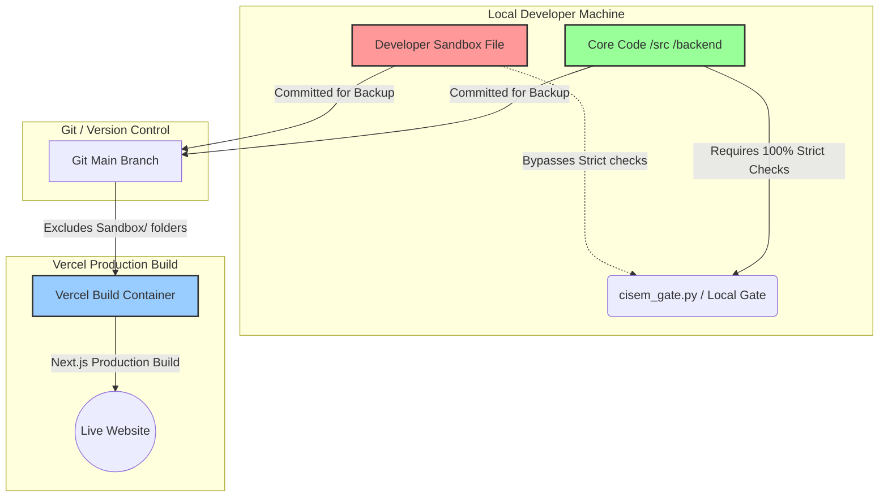

---
metadata:
  owner: "CISEM_GOVERNOR"
  canonical_location: "C:\\Users\\finky\\Desktop\\AntiGravity\\Cisem CsAg\\cisem_core\\planning\\2026-08-08__AntigravityLocal__YarivHuman__SandboxSystemSchemaAndStructure__V1.0.md"
  artifact_status: "DRAFT"
  maturity: "PROPOSAL"
  version: "1.0"
  inherited_authorities: []
  related_axioms: ["AX-10000", "PR-11000", "PR-13500"]
---

# Sandbox System Schema and Category Structure

1.1. **Introduction**:
The Sandbox is a fenced environment designed to foster rapid, ad-hoc experimentation by developers and teams without corrupting the production code or blocking local execution loops. This document details the exact positioning of the Sandbox in the platform schema, its folder structure, and its lifecycle promotion rules.

---

## 2. Sandbox Position in the System Schema

2.1. **Visual Schema Flow**:
The Sandbox is physically located inside the repository but is logically isolated from the core code runtime and cloud deployments. The diagram below illustrates its position:

2.2. **Fencing Mechanisms**:
- **Bypass at Compile Time**: When running locally, `cisem_gate.py` detects any targets containing `"sandbox"` in their file paths. The gate immediately skips strict 10-turn checks, registry hashing, and axiom verification. This provides a playground where experimental code can run dynamically.
- **Exclusion at Build Time**: The `tsconfig.json` file in the root workspace excludes `/sandbox/` folders from TypeScript compiler sweeps. Next.js does not trace, index, or bundle any sandbox files, ensuring that experimental code never loads on the live production website.

---

## 3. Predefined Sandbox Categories

3.1. **Structured Exploration Areas**:
To prevent files from cluttering the sandbox, all playground code must be placed inside one of these six category placeholders:

1. **`sandbox/website/`**:
   - *Scope*: Core CMS layouts, general site layouts, custom menus, and global navigation concepts.
2. **`sandbox/landing_page/`**:
   - *Scope*: Dynamic marketing pages, funnel widgets, dynamic images, and visual components.
3. **`sandbox/crm/`**:
   - *Scope*: Customer tables, subcontractor deals, pipeline dashboards, and transactional templates.
4. **`sandbox/social_media/`**:
   - *Scope*: Webhook triggers, content generators, API bridges, and marketing automation feeds.
5. **`sandbox/knowledge_hub/`**:
   - *Scope*: LLM orchestrations, parsing, document splitters, and PGVector indexing tests.
   - *Fencing*: Strict token and memory namespace isolation.
6. **`sandbox/vocabulary/`**:
   - *Scope*: Localized terms, custom business definitions, data-type maps, and structural glossaries.

---

## 4. Sandbox Promotion Lifecycles

4.1. **The Cleanroom Rebuild Model**:
Sandbox code is treated as "disposable proof-of-concept" work. When a sandbox project matures and is ready for promotion to production core:
- **Do NOT merge sandbox files directly**.
- **Rewrite from scratch in the core**: Using the sandbox code as a reference, build clean, type-safe, and RLS-compliant components inside `/src` or `/backend`.
- This ensures that code debt, ad-hoc hacks, and temporary console logs are pruned, while only verified, production-grade logic is integrated.

4.2. **Mandatory Ingestion Questions**:
Before promoting, the developer must answer these five questions:
1. *The Delta Check*: What files, database items, or configs exist in the sandbox version that do not exist in the core?
2. *The Cleanroom Choice*: Are we refactoring the sandbox code or building the core implementation from scratch based on a clean design contract?
3. *The Architectural Anchor*: How does this promoted feature satisfy the "Nothing Stands Alone" rule? Which 5-digit pillar does it link to?
4. *The Scaling Path*: How will this component handle multi-tenancy? (e.g. Does it use RLS, partitioned schemas, or worker queues?)
5. *The Reality Proof*: What is the smallest automated test or check that we can plug into `cisem_gate.py` to prove that the promoted module works in production?

---
history:
  - timestamp: "2026-08-08T23:33:00Z"
    action: "CREATED_SANDBOX_SCHEMA_SPEC"
    actor: "GEMINI_BRAIN"
    version: "1.0"
