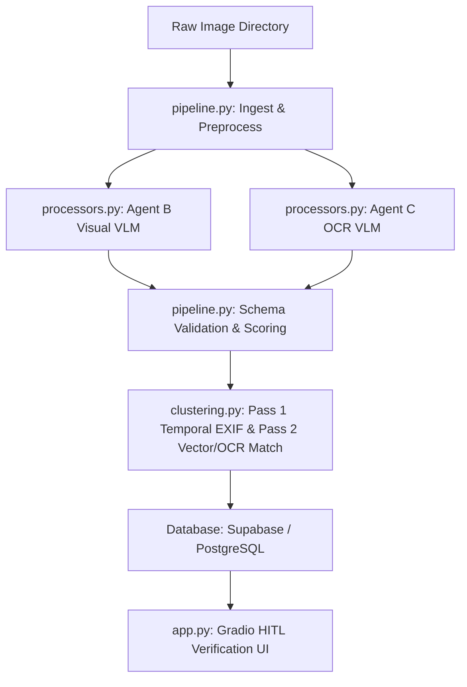

# Cosmic World Image Processing & Metadata Pipeline (CW-IPMP) — Draft Implementation Plan

This document outlines the draft implementation plan for the **Cosmic World Image Processing & Metadata Pipeline (CW-IPMP)**. It integrates the Governor's specific requirements, schemas, prompts, and clustering logic with the core axioms defined in the [Axioms and Principles Spec](file:///C:/Users/finky/Desktop/AntiGravity/Cisem%20CsAg/2026-08-07__CISEM__AntigravityLocal__AxiomsAndPrinciples__V1.20.md).

---

## 1. Goal & Context
The CW-IPMP serves as an automated ingestion, extraction, validation, and visual cluster management platform for processing 3,000 baseline physical award images. It eliminates manual cataloging by extracting structured attributes using deterministic Visual-Language Models (VLMs), group multi-angle shots, and surfaces an interactive Human-in-the-Loop (HITL) verification UI.

---

## 2. Core Architecture Components

We propose organizing the codebase in the isolated [Image processing](file:///c:/Users/finky/Desktop/AntiGravity/Sandbox%20Csag/Marketing%20&%20Sales/Image%20processing) directory with the following structure:

### Proposed Files

#### [NEW] [001_create_cosmic_world_schema.sql](file:///c:/Users/finky/Desktop/AntiGravity/Sandbox%20Csag/Marketing%20&%20Sales/Image%20processing/001_create_cosmic_world_schema.sql)
The SQL migration script defining the relational schema:
*   Enums: `crystal_shape_enum`, `base_material_enum`, `primary_material_enum`, `branding_tech_enum`, `view_angle_enum`, `customer_industry_enum`, `event_type_enum`, `verification_status_enum`.
*   Tables: `asset_clusters` (multi-angle groups) and `award_assets` (metadata catalog records).
*   Triggers and indexes to ensure database integrity and search performance.

#### [NEW] [schemas/](file:///c:/Users/finky/Desktop/AntiGravity/Sandbox%20Csag/Marketing%20&%20Sales/Image%20processing/schemas/)
Holds JSON schema validation files:
*   `agent_b_visual_schema.json`: Visual attributes (shapes, materials, primary angle).
*   `agent_c_ocr_schema.json`: OCR & Domain attributes (extracted texts, customer name, recipient name, event type).

#### [NEW] [processors.py](file:///c:/Users/finky/Desktop/AntiGravity/Sandbox%20Csag/Marketing%20&%20Sales/Image%20processing/processors.py)
Implements execution wrappers for raw images:
*   VLM calls using Google GenAI SDK with locked JSON schemas to ensure zero-tolerance parser enforcement.
*   Pre-processing helper (saving raw EXIF data, resizing).

#### [NEW] [clustering.py](file:///c:/Users/finky/Desktop/AntiGravity/Sandbox%20Csag/Marketing%20&%20Sales/Image%20processing/clustering.py)
Implements the 2-pass deterministic multi-angle grouping algorithm:
*   **Pass 1**: Sort by filename; group sequences where capture time delta is <= 45 seconds (max 6 images).
*   **Pass 2**: Calculate match score using EXIF sequence proximity, OCR entity match (+40% weight on match), and cosine visual embedding distance.
*   Auto-assigns cluster IDs if score is >= 0.85; flags for manual review if score is between 0.60 and 0.84.

#### [NEW] [pipeline.py](file:///c:/Users/finky/Desktop/AntiGravity/Sandbox%20Csag/Marketing%20&%20Sales/Image%20processing/pipeline.py)
Orchestrates execution:
*   Executes pre-processing, sequential VLM analysis, schema validation, and score compilation.
*   Calculates the aggregate confidence score: `Score = 0.5 * Visual + 0.5 * OCR`.
*   Sets lifecycle states (`Approved`, `Review`, `Flagged`).

#### [NEW] [app.py](file:///c:/Users/finky/Desktop/AntiGravity/Sandbox%20Csag/Marketing%20&%20Sales/Image%20processing/app.py)
A beautiful Gradio dashboard for HITL operator validation:
*   Keyboard-friendly shortcuts (Enter to approve, Tab to navigate fields, Space to zoom).
*   Side-by-side synchronized view grid showing all images belonging to the same cluster.
*   Interactive panel to edit, override, unlink, or manually approve fields.

---

## 3. Open Questions for Governor Review

> [!IMPORTANT]
> To prevent non-deterministic behavior and optimize integration, please review these architectural points:
>
> 1. **Visual Embedding Model Selection**: For Pass 2 clustering, should we use a lightweight local PyTorch model (e.g. MobileNetV3 / ResNet50 embeddings) to maintain a zero-cost local execution, or invoke a cloud embedding API?
> 2. **Database Connectivity**: Do you want to connect to a live Supabase instance (using credentials in `.env`) or mock database operations locally using a SQLite file (`cosmic_world.db`) for this sandbox prototype?
> 3. **Image Directory**: What local directory path should the pipeline watch for the raw input images during test runs?

---

## 4. Verification & Rollout Plan

### Phase 1: Local Ingestion & Schema Setup
*   Validate SQLite / PostgreSQL schemas.
*   Run baseline pre-processing on a sample set of 5 images.

### Phase 2: Schema Locking & VLM Test
*   Verify Agent B and Agent C schema conformance using 10 test responses.
*   Verify that any malformed JSON output triggers a fail-closed status block.

### Phase 3: Clustering Validation
*   Run temporal EXIF grouping and embedding vector distance calculations.
*   Inspect output cluster boundaries.

### Phase 4: Gradio UI Audit
*   Launch dashboard locally and test interactive HITL operations.
