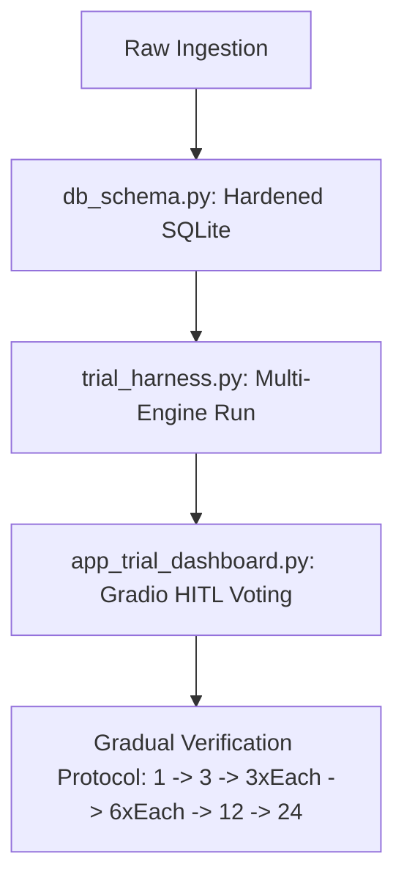

# Marketing & Sales Hub CsAg — Finalized Image Processing & SWIFT Trial Plan

This plan implements the architectural consensus for the **Marketing & Sales Hub CsAg** image processing and SWIFT trial system, adhering to the Governor's gradual verification protocol.

---

## 1. Core Architecture & Verification Steps

We will execute the implementation using a gradual stress-testing protocol, validating small batches of award images before scaling up.

### Components & Files (in [marketing-and-sales-engine](file:///C:/Users/finky/Desktop/Claude%20Code/Core%20Sights%20Platform/marketing-and-sales-engine))

1.  **[db_schema.py](file:///C:/Users/finky/Desktop/Claude%20Code/Core%20Sights%20Platform/marketing-and-sales-engine/db_schema.py)**: Hardened SQLite DB initialization.
2.  **[trial_harness.py](file:///C:/Users/finky/Desktop/Claude%20Code/Core%20Sights%20Platform/marketing-and-sales-engine/trial_harness.py)**: SWIFT trial harness to execute background removal, calculate soft-edge ratio and facet preservation edge scores, and save output previews.
3.  **[app_trial_dashboard.py](file:///C:/Users/finky/Desktop/Claude%20Code/Core%20Sights%20Platform/marketing-and-sales-engine/app_trial_dashboard.py)**: Gradio side-by-side dashboard with dark/white/checkerboard toggle and human vote logging.

---

## 2. Hardened Database Schema (marketing_and_sales_hub.db)

The local SQLite database will be initialized using WAL journal mode and foreign key constraints:

*   **`asset_clusters`**: Tracks multi-angle groupings.
*   **`award_assets`**: Hardened enums via `CHECK` constraints to prevent VLM string drift (crystal shapes, base materials, branding technologies, view angles).
*   **`trial_results`**: Tracks latency, soft-edge ratio, and facet preservation scores per engine run.

---

## 3. Gradual Trial Protocol (The 1 -> 3 -> 3x3 -> 6 Scale)

We will execute tests according to the Governor's strict gradual rollout protocol:
1.  **Test 1 Classic**: Run the trial on 1 reference award image, tweak, and achieve perfect results.
2.  **Test 3 Different Variations**: Stress-test the processing logic and prompts across 3 distinct award variations (e.g. Glass, Wood base, Acrylic).
3.  **Validate 3 of Each Category**: Take 3 items per type and run them to ensure edge cases are handled.
4.  **Batch Scale-up**: Scale up to 6 of each, then 12, then 24, validating results at every step.
